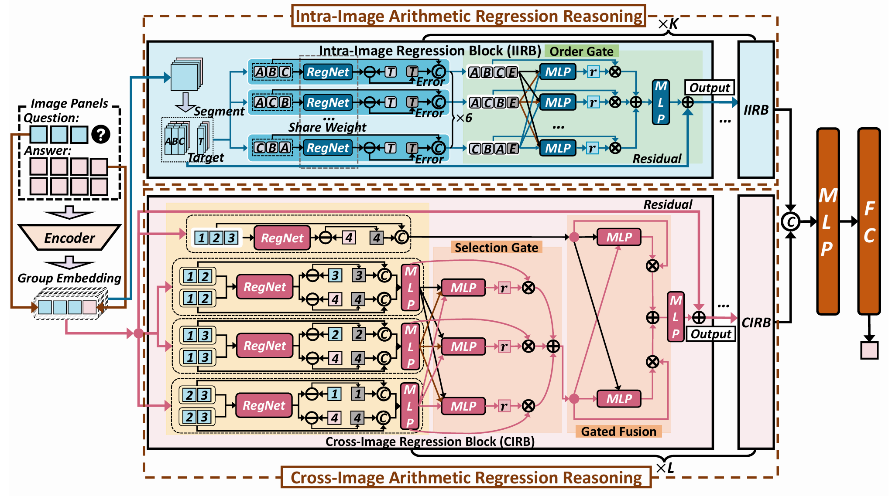
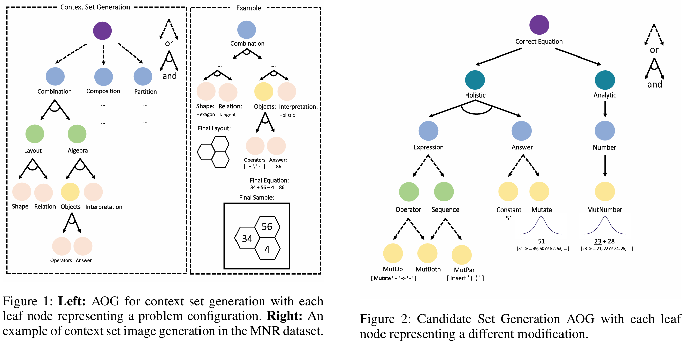
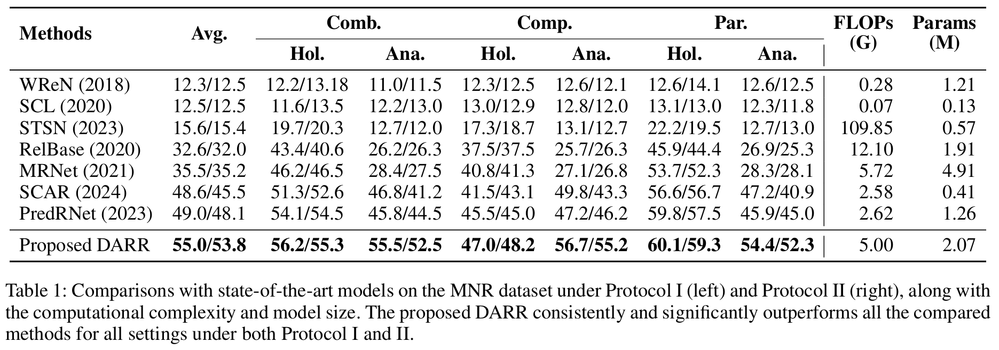

# DARR: A Dual-branch Arithmetic Regression Reasoning Framework for Solving Machine Number Reasoning

This is the official implementation of our AAAI 2025 Oral paper:  
[DARR: A Dual-Branch Arithmetic Regression Reasoning Framework for Solving Machine Number Reasoning](https://ojs.aaai.org/index.php/AAAI/article/view/32127)  
[Chengtai Li](https://scholar.google.com/citations?user=vYL7B1UAAAAJ&hl=en)\*, [Yee Yang Tan](https://scholar.google.com/citations?user=Q0HAjI4AAAAJ&hl=en)\*, [Yuting He](https://scholar.google.com/citations?user=xnNRSj8AAAAJ&hl=en), [Jianfeng Ren](https://research.nottingham.edu.cn/en/persons/jianfeng-ren), [Ruibin Bai](https://research.nottingham.edu.cn/en/persons/ruibin-bai), [Yitian Zhao](https://ytianzhao.github.io/), [Heng Yu](https://research.nottingham.edu.cn/en/persons/heng-yu), [Xudong Jiang](https://personal.ntu.edu.sg/exdjiang/default.htm)  
*Proceedings of the AAAI Conference on Artificial Intelligence (AAAI)*, 2025.  
[[Video](https://underline.io/lecture/113331-darr-a-dual-branch-arithmetic-regression-reasoning-framework-for-solving-machine-number-reasoning)] [[Poster](https://underline.io/lecture/113331-darr-a-dual-branch-arithmetic-regression-reasoning-framework-for-solving-machine-number-reasoning?posterExpanded=true)]




## Machine Number Reasoning (MNR) Dataset



## Main Results



## Requirements
For machine number reasoning (MNR) dataset:
- Python 2.7
- OpenCV
- See `mnr_dataset/requirements.txt` for a detailed list of packages required.

## Experiments
Model training and evaluation code will be released soon.


## Citation
If you find this repo useful in your research, please consider citing our paper as follows:

```
@inproceedings{li2025darr,
  title={DARR: A dual-branch arithmetic regression reasoning framework for solving machine number reasoning},
  author={Li, Chengtai and Tan, Yee Yang and He, Yuting and Ren, Jianfeng and Bai, Ruibin and Zhao, Yitian and Yu, Heng and Jiang, Xudong},
  booktitle={Proceedings of the AAAI Conference on Artificial Intelligence},
  volume={39},
  number={2},
  pages={1373--1382},
  year={2025}
}
```

## Acknowledgement
We sincerely appreciate the following github repos a lot for their valuable code base:
https://github.com/zwh1999anne/Machine-Number-Sense-Dataset


## Python 3 Compatibility Update

This version updates the original `mnr_dataset` generation code to run under Python 3.12.

Main changes include:

- Migrated Python 2 syntax to Python 3 syntax.
- Replaced Python 2-style tuple parameter unpacking in function definitions.
- Updated `range(...)` usages for compatibility with `numpy.random.choice`.
- Fixed integer division issues caused by Python 3’s `/` behavior.
- Ensured array slicing, loop ranges, and index calculations use integer values.
- Fixed OpenCV drawing errors by converting generated coordinates to integers.
- Updated constants such as `CENTER` to avoid float coordinates.
- Verified that the dataset generation script can run successfully under Python 3.12.

This update focuses only on compatibility and does not intentionally change the original dataset generation logic.

## FVNB-MNR Fuzzy Rule Binding Prototype

This repository also includes an experimental FVNB-MNR v0 generator described in `doc/plane.md`. It keeps the original MNR code path untouched and adds a separate fuzzy visual-number binding pipeline under `mnr_dataset/fvnb_*.py`.

Generate a small FVNB-MNR probe set:

```bash
python3 -m mnr_dataset.fvnb_main \
  --num_prob 10 \
  --output_dir FVNB-ProbSet \
  --seed 0 \
  --rule_schema mixed
```

Each generated `.npz` contains:

- `context_images`: shape `(3, H, W)`, with default `H=W=128`
- `answer_set_images`: shape `(8, H, W)`, with default `H=W=128`
- `correct_answer_image_index`: the 8-way label
- `metadata_json`: scene graph, rule schema, raw/normalized role memberships, fuzzy truth scores, hard-role scores, negative types, and shortcut labels

The generator also writes:

- `metadata.jsonl`: one JSON metadata row per sample
- `generation_report.json`: rule counts, negative-type counts, validity checks, fuzzy-oracle accuracy, hard-role accuracy, and hard-role shortcut tie rate

Supported rule schemas:

- `diff_outer_inner_boundary`: `outer - inner = boundary`
- `sum_outer_inner_boundary`: `outer = inner + boundary`
- `ratio_outer_inner_boundary`: `outer / inner = boundary`
- `mixed`: round-robin over all schemas

Supported t-norms:

- `product`
- `min` / `minimum` / `godel`
- `lukasiewicz`

Render one generated sample as an overview PNG:

```bash
python3 -m mnr_dataset.fvnb_visualize FVNB-ProbSet/fvnb_000000.npz \
  --output FVNB-ProbSet/fvnb_000000_grid.png
```

Run the FVNB-MNR tests:

```bash
python3 -m unittest tests.test_fvnb_mnr -v
```

## VQ-Expr 1-5 Calibrated Visual Expression Dataset

This repository also includes a VQ-Expr generator for the newer no-visible-digit design described in `doc/plan.md`. VQ-Expr uses sample-local calibration to decode fuzzy continuous visual attributes into values in `1..5`, compiles visual rule graphs into executable Answer AoTs, and creates 8-way image candidates with single-mutation counterfactual negatives. The presentation view is a RAVEN-style context/choice split: a 1x3 row of complete context panels plus eight full-panel answer candidates. The current visual surface is an A-SIG-lite structured composition: grayscale only, one quantity entity per role, one dynamic semantic boundary per panel, explicit four-region in/out binding, no role labels, and RAVEN-inspired configuration families such as `3x3Grid`, `2x2Grid`, `Out-InGrid`, `Out-InCenter`, and `Left-Right`.

Generate a small VQ-Expr probe set:

```bash
python3 -m mnr_dataset.vqexpr_main \
  --num_prob 10 \
  --output_dir VQExpr-ProbSet \
  --seed 0 \
  --rule_schema mixed
```

Each generated `.npz` contains:

- `context_images`: 3 rendered complete context panels for the 1x3 context row.
- `answer_set_images`: 8 rendered image candidates.
- `correct_answer_image_index`: the 8-way label.
- `metadata_json`: calibration context, strip semantics, structured visual surface metadata, per-panel `visual_scene_graph`, dynamic boundary instances, visual quantity family, quantity objects, visual rule graph, Answer AoT, expression schema, candidate mutation logs, scores, and validity checks.

The generator also writes:

- `metadata.jsonl`: one JSON metadata row per sample.
- `generation_report.json`: rule counts, visual-family counts, correct-index counts, candidate visual-stat audit, candidate-only heuristic audit, negative counts, validity counts, and generator settings.
- `vqexpr_000000_overview.png`: a quick visual audit for the first sample.

Current schema:

- `schema_version`: `vqexpr_1_5_avr_1x3_v8_dynamic_boundary`
- `visual_surface.style`: `dynamic_boundary_expression_grayscale_a_sig_lite`
- `visual_surface.scene_graph_schema`: `a_sig_lite_v4`
- visual attribute surfaces: `size_level`, `color_lightness`, `stroke_width`, `aspect_ratio`
- boundary shapes: `circle`, `square`, `diamond`, `hexagon`
- boundary split axes: `horizontal` or `vertical`; every sample binds `q1/q2` to two outer regions and `q3/q4` to two inner regions. Positions are sampled along the split axis, while the cross-axis is aligned to an off-center lane so horizontal and vertical structures remain visually unambiguous.

Supported rule schemas:

- `serial`
- `parallel`
- `nested`
- `inverse`
- `calibration`
- `mixed`

Run the VQ-Expr tests:

```bash
python3 -m unittest tests.test_vqexpr -v
```

Run post-hoc VQ-Expr audits on an existing generated set:

```bash
python3 -m mnr_dataset.vqexpr_audit VQExpr-ProbSet \
  --output VQExpr-ProbSet/audit_report.json
```

The post-hoc audit recomputes the metadata oracle, score-argmax oracle, candidate visual statistics, hand-written candidate-only heuristics, and a small learned linear candidate-only probe over visual statistics and answer slot.

## CIFAR-MNR v1

CIFAR-MNR v1 is a direct visual-surface variant of the original DARR-MNR generator. It keeps the original problem tree, arithmetic rules, context/answer split, and `.npz` schema, but replaces every visible digit character with a CIFAR-10 image tile whose class id represents that digit:

```text
0=airplane, 1=automobile, 2=bird, 3=cat, 4=deer,
5=dog, 6=frog, 7=horse, 8=ship, 9=truck
```

Generate a small CIFAR-MNR v1 set:

```bash
python3 -m mnr_dataset.cifar_mnr_main \
  --num_prob 1 \
  --output_dir CIFAR-MNR-v1 \
  --cifar_root ./data
```

Each generated `.npz` remains compatible with the original MNR data format:

- `context_images`: 3 context panels.
- `answer_set_images`: 8 answer candidates.
- `correct_answer_image_index`: the 8-way answer index.

The generator writes `cifar_mnr_v1_report.txt` with the CIFAR digit-class mapping and generation settings. Use `--allow_synthetic_fallback` only for local smoke tests when CIFAR-10 or `torchvision` is unavailable; benchmark data should use real CIFAR-10 images.

## VG-MNR v0 Prototype

This repository also includes a minimal VG-MNR prototype inspired by `doc/vg_mnr_benchmark_paper_plan.md`. It is a first runnable version of the proposed visually grounded machine number reasoning benchmark: three solved context panels, one query panel, and a small expression-tree-based visual syntax.

## VG-MNR v0 prototype

Generate a small VG-MNR demo set:

```bash
python3 -m mnr_dataset.vgmnr_main \
  --num_prob 10 \
  --output_dir demo_samples/VGMNR-ProbSet \
  --seed 0 \
  --panel_size 128 \
  --mode full
```

The prototype currently supports three modes:

- `full`: visually grounded context/query panels.
- `no_visual`: removes functional visual relations to support visual ablation checks.
- `no_context`: removes context panels to support context ablation checks.

Each generated `.npz` contains:

- `context_images`: 3 rendered context panels.
- `answer_set_images`: 8 rendered answer candidates.
- `correct_answer_image_index`: the 8-way label.
- `metadata_json`: latent program, visual necessity certificate fields, and per-sample panel metadata.

The generator also writes:

- `generation_report.json`: basic generation summary.
- `png_overviews/`: PNG previews for quick visual inspection.

Scope and limitations:

- This is a **stage-0 prototype** for communication and iteration, not the full benchmark.
- The prototype already covers the ablation directions requested in the proposal at a minimal level.
- It does **not yet** implement exact-collision pairs, full diagnostic splits, or the complete VNC filtering procedure described in the proposal.
- Candidate construction is still placeholder-grade for demonstration, so the next step is to make it benchmark-grade before running model experiments.

Recommended next priorities:

- exact-collision construction
- stronger ablation filtering
- split design for IID/OOD diagnostics
- benchmark-grade candidate construction and scoring
