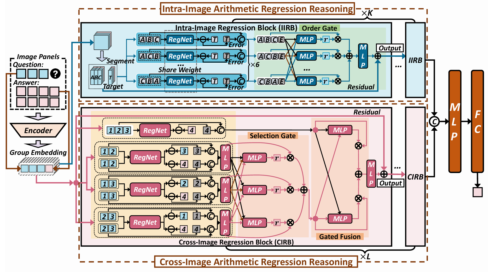
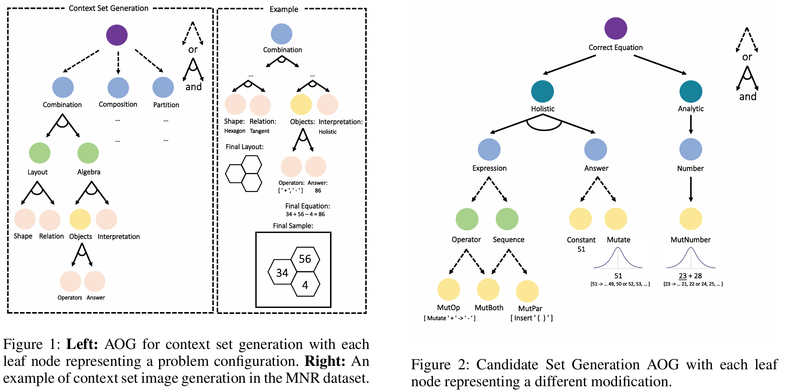
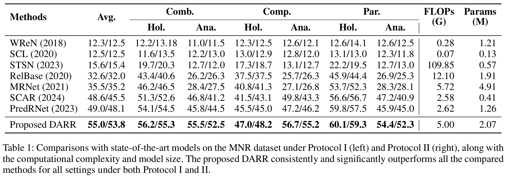

# DARR: A Dual-branch Arithmetic Regression Reasoning Framework for Solving Machine Number Reasoning

This is the official implementation of our AAAI 2025 Oral paper:  
[DARR: A Dual-Branch Arithmetic Regression Reasoning Framework for Solving Machine Number Reasoning](https://ojs.aaai.org/index.php/AAAI/article/view/32127)  
[Chengtai Li](https://scholar.google.com/citations?user=vYL7B1UAAAAJ&hl=en)\*, [Yee Yang Tan](https://scholar.google.com/citations?user=Q0HAjI4AAAAJ&hl=en)\*, [Yuting He](https://scholar.google.com/citations?user=xnNRSj8AAAAJ&hl=en), [Jianfeng Ren](https://research.nottingham.edu.cn/en/persons/jianfeng-ren), [Ruibin Bai](https://research.nottingham.edu.cn/en/persons/ruibin-bai), [Yitian Zhao](https://ytianzhao.github.io/), [Heng Yu](https://research.nottingham.edu.cn/en/persons/heng-yu), [Xudong Jiang](https://personal.ntu.edu.sg/exdjiang/default.htm)  
*Proceedings of the AAAI Conference on Artificial Intelligence (AAAI)*, 2025.  
[[Video](https://underline.io/lecture/113331-darr-a-dual-branch-arithmetic-regression-reasoning-framework-for-solving-machine-number-reasoning)] [[Poster](https://underline.io/lecture/113331-darr-a-dual-branch-arithmetic-regression-reasoning-framework-for-solving-machine-number-reasoning?posterExpanded=true)]




## Machine Number Reasoning (MNR) Dataset



## Main Results



## Requirements
For machine number reasoning (MNR) dataset:
- Python 2.7
- OpenCV
- See `mnr_dataset/requirements.txt` for a detailed list of packages required.

## Experiments
Model training and evaluation code will be released soon.


## Citation
If you find this repo useful in your research, please consider citing our paper as follows:

```
@inproceedings{li2025darr,
  title={DARR: A dual-branch arithmetic regression reasoning framework for solving machine number reasoning},
  author={Li, Chengtai and Tan, Yee Yang and He, Yuting and Ren, Jianfeng and Bai, Ruibin and Zhao, Yitian and Yu, Heng and Jiang, Xudong},
  booktitle={Proceedings of the AAAI Conference on Artificial Intelligence},
  volume={39},
  number={2},
  pages={1373--1382},
  year={2025}
}
```

## Acknowledgement
We sincerely appreciate the following github repos a lot for their valuable code base:
https://github.com/zwh1999anne/Machine-Number-Sense-Dataset


## Python 3 Compatibility Update

This version updates the original `mnr_dataset` generation code to run under Python 3.12.

Main changes include:

- Migrated Python 2 syntax to Python 3 syntax.
- Replaced Python 2-style tuple parameter unpacking in function definitions.
- Updated `range(...)` usages for compatibility with `numpy.random.choice`.
- Fixed integer division issues caused by Python 3’s `/` behavior.
- Ensured array slicing, loop ranges, and index calculations use integer values.
- Fixed OpenCV drawing errors by converting generated coordinates to integers.
- Updated constants such as `CENTER` to avoid float coordinates.
- Verified that the dataset generation script can run successfully under Python 3.12.

This update focuses only on compatibility and does not intentionally change the original dataset generation logic.

## SSPredRNet self-supervised RAVEN experiments

[sspredrnet/](sspredrnet/) contains a focused implementation of the original
neural prediction-error reasoner with component views. A verified 20-epoch
RAVEN experiment achieved 70.38% test accuracy for the validation-selected
checkpoint and 67.66% at epoch 20. The method uses public layout priors and
two views per puzzle. Training commands, checkpoints, verification records,
and comparison limits are documented in [sspredrnet/README.md](sspredrnet/README.md).

[program_ssl/](program_ssl/) studies two additions in a shared executable
completion energy framework: CECS self-supervision and SER-PaV support evidence
verification. Eight-epoch adaptation from the frozen component-view baseline
achieved 70.26% test accuracy after validation selection. Known-panel retrieval
improved, while candidate accuracy remained below the 70.38% baseline and
original-reasoner continuation. The [contribution definitions](research/component-program-ssl/contributions.md),
[complete results](research/component-program-ssl/results.md), checkpoints and
evaluation records document those limits. The current runtime retains one CECS
training task and one SER-PaV inference path; historical ablation code is
available at commit `f43cf58`. See [the current commands](program_ssl/README.md).

[attention_ssl/](attention_ssl/) aligns the known-panel self-supervised ranking
loss with deployment and replaces six discrete support hypotheses with an
attention relation encoder and a differentiable support-fitted completion map.
Three full eight-epoch adaptations achieved validation-selected test scores of
71.24%, 71.24%, and 71.17% (mean 71.22%, sample standard deviation 0.04%), against
the same frozen validation-selected baseline's 71.04%. All three final scores
also exceeded that baseline. The baseline's prior training selection budget is
28 epochs; each adaptation adds eight. These results show a small matched
overall gain; they do not establish better perception or semantic rule discovery.
See [the 2026 paper-based design](research/ssl-attention-2026/design.md),
[full results and controls](research/ssl-attention-2026/results.md), and
[training/evaluation commands](attention_ssl/README.md).

[structured_ssl/](structured_ssl/) contains an experimental, more substantial
redesign: a trainable three-level pixel/object encoder, complete-object masking
on visible known panels, and three-stage support-compiled P/G/V updates with
alternating depth/token attention. It adds 2,182,902 trainable parameters and
preserves the measured attention anchor. Synthetic CPU boundary, gradient and
permutation checks passed; **no full RAVEN accuracy is available for this
redesign yet**. See [the two contribution definitions](research/structured-ssl-2026/contributions.md)
and [source-grounded 2026 design and experiment protocol](research/structured-ssl-2026/design.md).
