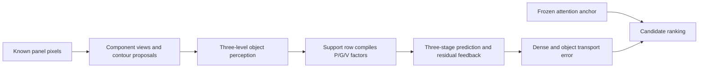

# SSPredRNet: structured SSL and SER-PaV

This branch contains the RAVEN self-supervised experiments. The main runtime is
[`structured_ssl`](structured_ssl/README.md). The original DARR paper and MNR
dataset generator are documented separately in [`mnr_dataset`](mnr_dataset/README.md).

## Pipeline

```mermaid
flowchart LR
  A[Known panel pixels] --> B[Component views and contour proposals]
  B --> C[Three-level object perception]
  C --> D[Support row compiles P/G/V factors]
  D --> E[Three-stage prediction and residual feedback]
  E --> F[Dense and object transport error]
  G[Frozen attention anchor] --> H[Candidate ranking]
  F --> H
```

During adaptation, the first complete row and the next two panels predict the
known sixth panel. Whole-object masking is an additional task on the first five
panels. Candidates, answer indices and XML do not enter this adaptation. At
inference, each complete row supports a prediction of the missing ninth panel;
the eight candidates are compared only as targets.

## Code responsibilities

| Directory | Responsibility |
| --- | --- |
| `structured_ssl/` | Current object SSL and support-compiled SER-PaV |
| `attention_ssl/` | Measured attention model, frozen inside the current anchor |
| `sspredrnet/` | Original reasoner, shared data, feature error and checkpoints |
| `research/` | Paper sources, explicit contribution controls, diagnostics and evidence |
| `program_ssl/results/` | Historical program experiment artifacts; no executable API |
| `mnr_dataset/` | Independent DARR/MNR dataset generator |

Install the Python dependencies with `python -m pip install -r sspredrnet/requirements.txt`.
Train, resume and evaluate using the [current commands](structured_ssl/README.md).
The [cleanup decisions and verification](research/structured-ssl-2026/cleanup.md)
document removed interfaces and compatibility with the measured checkpoints.

## Evidence and target

The user's current target is **at least 70% test accuracy**, with checkpoint
selection on validation and final-epoch results reported separately. Accuracy
alone does not establish a benefit from either new contribution. Reports also
include the frozen anchor, changed answers and a support intervention.

The v3 structured experiment is still running; its test accuracy is pending.
The [native control audit](research/structured-ssl-2026/native_completed_audit.json)
records 71.47% test accuracy after 16 epochs of original-reasoner continuation.
This control uses unlabeled candidate negatives; the new adaptation excludes
candidates. See the [protocol and design](research/structured-ssl-2026/design.md)
and [contribution definitions](research/structured-ssl-2026/contributions.md).

Historical results retain their original configurations, source hashes and
checkpoints. Reproduce them from the exact source export or recorded Git revision;
a cleaned checkout cannot replace a source sealed by an earlier run. Architecture
checks and refactor parity checks are not benchmark accuracy results.
