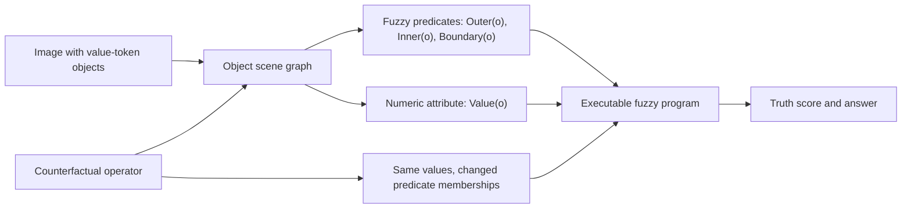

# AFVNB-MNR 顶会 Benchmark 蓝图：把数字作为 Fuzzy Scene Graph 的对象属性

日期：2026-06-18

本文档是对 `doc/plane.md` 和 `doc/top_benchmark_alignment_attribute_fuzzy_vnb.md` 的进一步收敛：前者把 fuzzy logic 放进 rule semantics，但仍以 `digit anchor` 为核心；后者已经指出 ontology 应从 anchor 改为 object attribute。这里把两者合并成一个可以按顶会 benchmark 标准执行的版本。

配套执行计划见 [`doc/afvnb_implementation_plan.md`](./afvnb_implementation_plan.md)，实验协议见 [`doc/afvnb_experiment_protocol.md`](./afvnb_experiment_protocol.md)，metadata 合同见 [`doc/afvnb_metadata_schema.md`](./afvnb_metadata_schema.md)，发布清单见 [`doc/afvnb_dataset_card_and_release_checklist.md`](./afvnb_dataset_card_and_release_checklist.md)，论文包装见 [`doc/afvnb_paper_package.md`](./afvnb_paper_package.md)，当前完成度审计见 [`doc/afvnb_goal_completion_audit.md`](./afvnb_goal_completion_audit.md)。蓝图负责定义研究对象和 benchmark 标准；执行计划负责把它拆成可测试的 scene/program/verifier/generator/baseline 任务；实验协议负责规定如何用数据审计、baseline、强模型、人类 sanity 和 falsifier 证明这个 benchmark 成立；metadata 合同和发布清单负责保证实现与开源 artifact 不偏离 object-attribute fuzzy program ontology；论文包装负责把 title、teaser、contribution、related work、experiments 和 claim-evidence ledger 统一到同一个机制；完成度审计负责防止把设计级完成误报为 benchmark 已验证完成。

核心判断：

```text
不要把数字当作贴在几何结构上的 glyph。
要把数字建模为 value-token object 的 numeric_value attribute。

不要让 fuzzy 只描述图像模糊或位置不确定。
要让 fuzzy predicate 直接进入 executable rule truth。

不要把 benchmark 做成更花的 puzzle。
要做成 object attributes + fuzzy predicates + executable program + counterfactual operators。
```

建议项目名：

```text
AFVNB-MNR
Attribute-Fuzzy Visual-Number Binding for Machine Number Reasoning
```

## 1. 当前结论

FVNB v0 已经抓到一个正确方向：

```text
visual structure -> fuzzy role membership -> rule truth -> deterministic label
```

但它还没有完全抓住用户指出的根因。当前 v0 的生成样例仍然是：

```text
anchor = {position, value, membership}
```

这会让 `value` 像是贴在坐标点上的文本，而不是对象自身的属性。顶会 benchmark 更自然的 ontology 应该是：

```text
object = {
  id,
  class,
  numeric_value,
  visual_attributes,
  geometry,
  fuzzy_predicates
}
```

rule 应该作用在 object variables 上：

```text
exists distinct x, y, z in ValueToken:
  Outer(x) AND Inner(y) AND Boundary(z)
  AND Equal(Value(x) - Value(y), Value(z))
```

这样，“同样的数字，在不同视觉结构中绑定到不同角色 -> 算式语义改变”就不是人为规定，而是 first-order fuzzy program 的自然结果：变量绑定到对象，谓词给出对象的角色隶属度，属性函数读出对象的 numeric value，算术谓词再决定 rule truth。

## 2. Yangshi 式研究对象

### 2.1 Proxy split

| 项 | 定义 |
| --- | --- |
| Field momentum | 视觉数学、抽象视觉推理、多模态推理 benchmark 正在强调 explicit visual dependency、programmatic generation、counterfactual evaluation 和 model shortcut diagnosis。 |
| Proxy A | 模型能读取图中数字，并在固定或离散化的视觉结构中匹配算式。 |
| Construct B | 模型能把 numeric attributes 和 fuzzy visual predicates 联合绑定，并把这种绑定传播到 rule truth。 |
| Regime R | 同一组对象和数字值保持不变，但 fuzzy predicate memberships 或 value-object binding 改变，导致 executable rule truth 改变。 |
| Mechanism H | Attribute-Predicate Binding Collapse：模型把数字属性和定义角色的 fuzzy predicate 解耦，只保留 number-only、coordinate-only 或 hard-role shortcut。 |
| Artifact O | 一个带 object-level scene graph、fuzzy first-order program、counterfactual operators、deterministic verifier 和 shortcut metrics 的 benchmark。 |

### 2.2 一句话 thesis

```text
Although visual math and abstract reasoning benchmarks increasingly test whether models use diagrams,
current abstract visual arithmetic can still treat numbers as external glyphs read from fixed visual templates;
AFVNB-MNR exposes this attribute-predicate binding gap through executable fuzzy scene-graph programs
and controlled counterfactual candidates.
```

这句话可以作为内部研究门槛，但还不能直接作为摘要强 claim。真正写论文前，必须先有 strong-model baselines、candidate-only audit、counterfactual consistency 和 human sanity check。

## 3. 顶会 Benchmark 调研：哪些标准必须继承

### 3.1 结构化诊断类 benchmark

| 工作 | 顶会标准 | 对 AFVNB 的约束 | 不应照搬的部分 |
| --- | --- | --- | --- |
| [CLEVR, CVPR 2017](https://arxiv.org/abs/1612.06890) | 诊断 benchmark 要有 scene graph、functional program、bias control 和 reasoning-type annotations。 | 每题保存 object scene graph、fuzzy program、oracle assignment、counterfactual type；答案能从 metadata 复算。 | 不要把任务扩成语言 VQA；AFVNB 第一版应保持 image-only multiple choice。 |
| [GQA, CVPR 2019 Oral](https://arxiv.org/abs/1902.09506) | scene graph 生成 compositional questions，并报告 consistency、grounding、plausibility 等细粒度指标。 | 不只报告 8-way accuracy；要报告 attribute grounding、predicate grounding、program consistency、counterfactual consistency。 | 不追真实图像场景覆盖；我们的优势是 controlled abstract program。 |
| [RAVEN, CVPR 2019](https://arxiv.org/abs/1903.02741) | 把 RPM 任务结构化为 hierarchical representation，让视觉结构进入关系推理。 | 承认 RAVEN 已经做“视觉结构进入规则”；AFVNB 的差异是 graded fuzzy truth，而不是 discrete structure。 | 不要再做一个 RAVEN-like 离散规则集。 |
| [PGM, ICML 2018](https://proceedings.mlr.press/v80/barrett18a.html) | generalization regime 是 benchmark 的核心，不只是 IID 测试集。 | 必须有 Attribute-OOD、Predicate-OOD、Program-OOD、Family-OOD、Style-OOD。 | 不要把所有难度混在一个总分里。 |
| [RAVEN-FAIR / Scale-Localized Abstract Reasoning, CVPR 2021](https://arxiv.org/abs/2009.09405) | 候选集构造不平衡会导致 candidate-only shortcut。 | 需要 candidate-only audit；负例必须由 counterfactual operator 生成，视觉统计平衡。 | 不要用随机 wrong candidates 凑数量。 |
| [Bongard-LOGO, NeurIPS 2020](https://arxiv.org/abs/2010.00763) | program-guided generation 可以保持人类可解释 concept；同一对象在不同 context 中可有不同解释。 | rule program 要短、可读、可复算；同一 numeric attribute 在不同 predicate context 中改变作用。 | 不要用装饰复杂度替代 concept complexity。 |
| [PTR, NeurIPS 2021](https://arxiv.org/abs/2112.05136) | 结构化视觉推理需要 object/part attributes、relations 和可诊断 annotations。 | 每个 value token 必须声明 numeric_value、visual attributes、geometry、predicate memberships。 | 第一版不做复杂部件层级，先做干净 object schema。 |

### 3.2 视觉数学与多模态数学 benchmark

| 工作 | 顶会标准 | 对 AFVNB 的约束 | 我们的定位差异 |
| --- | --- | --- | --- |
| [MathVista, ICLR 2024](https://arxiv.org/abs/2310.02255) | 广覆盖 visual contexts，评估 foundation models 的数学推理。 | 说明视觉数学是高动量方向；实验可选若干 LMMs 作为 strong baselines。 | AFVNB 不比覆盖面；只做机制诊断。 |
| [MathVerse, ECCV 2024](https://arxiv.org/abs/2403.14624) | 同一题构造不同信息版本，检验模型是否真的看图。 | 每个 seed 至少有 full、attribute-only、predicate-only、counterfactual variants，用于 Visual Dependency Index。 | 不依赖自然语言改写，避免 text leakage。 |
| [MATH-Vision, NeurIPS 2024 D&B](https://arxiv.org/abs/2402.14804) | 高质量竞赛题、学科覆盖和难度分级。 | 学习其 category/error analysis，但不要把 AFVNB 做成真实竞赛题库。 | 我们的难度来自 causal factor control，不来自题库广度。 |
| [DynaMath, 2024/2025](https://arxiv.org/abs/2411.00836) | seed question 通过程序生成变体，测试 robustness。 | AFVNB 的基本单位应是 seed program family，而不是单题；报告 seed-worst accuracy。 | DynaMath 多是动态变体；AFVNB 变体是 attribute-predicate intervention。 |
| [MV-MATH, CVPR 2025](https://arxiv.org/abs/2502.20808) | 多图上下文是真实数学任务中的新变量，且需要 detailed annotations。 | MNR 的 3 context + 8 candidate 可以重新解释为 multi-panel evidence family；必须保存 panel 间 shared program。 | MV-MATH 面向真实 K-12 多图题；AFVNB 面向受控 multi-panel 机制。 |
| [VC-Bench, 2025](https://arxiv.org/abs/2504.18589) | explicit visual dependency 是 benchmark 的显性目标。 | 需要设计 number-only、attribute-only、predicate-only ablation；没有视觉 predicate 时应接近随机。 | 不做大规模自然视觉数学；做可验证的 explicit dependency。 |
| [VisuLogic, 2025](https://arxiv.org/abs/2504.15279) | 避免 language-based shortcuts，测 vision-centric reasoning。 | 输入尽量 image-only 或 minimal prompt；不要在题干中泄露 outer/inner/boundary 或负例类型。 | AFVNB 的语言部分只用于 metadata 和 debug，不用于 evaluation。 |
| [VisioMath, ICLR 2026](https://arxiv.org/abs/2506.06727) | 图像候选之间应 visually similar，考察多图候选比较。 | 8 个 candidates 都应该是图像，且 appearance complexity/value distribution 平衡。 | AFVNB 的 near-miss 不是肉眼相似而已，而是只破坏一个 semantic atom。 |
| [TACIT, 2026](https://arxiv.org/abs/2603.00206) | programmatic generation、deterministic seeded verification、near-miss distractor 每个只违反一个 structural constraint。 | AFVNB 每个 negative 由 counterfactual operator 生成，并由 verifier 证明只破坏一个主要 constraint。 | TACIT 覆盖多推理域；AFVNB 专注 arithmetic attribute-predicate binding。 |

### 3.3 Fuzzy logic 与 neuro-symbolic rule 标准

| 工作 | 标准 | 对 AFVNB 的约束 |
| --- | --- | --- |
| [Zadeh, Fuzzy Sets, 1965](https://doi.org/10.1016/S0019-9958(65)90241-X) | fuzzy set 是对象对集合的连续隶属度，不是视觉噪声。 | `Outer(o)`、`Inner(o)`、`Boundary(o)` 必须是 object predicate，返回 `[0,1]`。 |
| [Logic Tensor Networks / Real Logic, 2016](https://arxiv.org/abs/1606.04422) | first-order formulas 可以有 `[0,1]` truth value。 | rule 应写成变量、谓词、函数和量词，而不是 role name 的外部算式。 |
| [Logic Tensor Networks, AIJ 2022](https://arxiv.org/abs/2012.13635) | many-valued differentiable first-order logic 可作为 neuro-symbolic representation language。 | AFVNB 的 oracle 不必可训练，但应采用同类 object-variable + predicate truth 的可执行语义。 |

## 4. 为什么“同样数字，不同视觉结构 -> 算式语义改变”是合理的

合理性来自三个层次的绑定，而不是来自人为把数字重命名。

### 4.1 层次一：数字是对象属性

每个可见数字不是裸 token，而是一个 value-token object：

```json
{
  "id": "o_A",
  "class": "value_token",
  "numeric_value": 8,
  "visual_attributes": {"shape": "circle", "text": "8"},
  "geometry": {"center": [24, 64]},
  "fuzzy_predicates": {"Outer": 0.94, "Inner": 0.02, "Boundary": 0.04}
}
```

图像中的 “8” 是 `numeric_value=8` 的渲染，不是独立于对象的符号。模型要解决任务，必须知道是哪个 object 携带这个 attribute。

### 4.2 层次二：视觉结构定义 fuzzy predicates

区域、边界、距离、包含关系定义 object 的 predicate membership：

```text
Outer(o_A) = 0.94
Inner(o_B) = 0.91
Boundary(o_C) = 0.88
```

这些值不来自装饰，而来自几何 signed distance、boundary band、containment 或 set relation。视觉结构变化会改变 predicate truth。

### 4.3 层次三：rule 读取 predicate 绑定下的 attribute

rule 不再是：

```text
outer - inner = boundary
```

而是：

```text
exists x,y,z:
  Outer(x) AND Inner(y) AND Boundary(z)
  AND Equal(Value(x) - Value(y), Value(z))
```

如果同样的三个对象 `o_A, o_B, o_C` 在两个 scene 中有不同 predicate memberships，那么最优 assignment 和 truth score 就会改变。算式语义改变不是因为数字换了，而是因为对象在 fuzzy visual structure 中扮演的角色变了。

### 4.4 一个可以画成 teaser 的例子

设三个 value-token objects：

```text
o_A.numeric_value = 8
o_B.numeric_value = 3
o_C.numeric_value = 5

Program:
  Outer(x) AND Inner(y) AND Boundary(z)
  AND Equal(Value(x) - Value(y), Value(z))
```

Scene 1：

```text
Outer(o_A)=0.96, Inner(o_B)=0.94, Boundary(o_C)=0.91
Equal(8-3,5)=1
Product truth = 0.96 * 0.94 * 0.91 = 0.821
```

Scene 2 保持数字、对象 id、局部 glyph 都不变，只移动 boundary band：

```text
Outer(o_A)=0.54, Inner(o_B)=0.55, Boundary(o_C)=0.52
hard argmax roles may still be Outer(o_A), Inner(o_B), Boundary(o_C)
Equal(8-3,5)=1
Product truth = 0.154
```

这就是 hard parser 会失败的地方：离散角色没变，但 fuzzy truth 已经掉到阈值以下。它合理，因为 fuzzy set 的 membership 本来就是 role evidence 的强度，rule 的 AND 本来就应该传播这个强度。

### 4.5 合理性检查

一个 counterfactual 只有满足以下条件才可进入 benchmark：

| 检查 | 说明 |
| --- | --- |
| Semantic closure | 所有标签必须由 object scene graph + executable program 复算，不能手工指定。 |
| Single intervention | 每个 negative 主要只改变一个因素：attribute、predicate、binding、program atom 或 context consistency。 |
| Non-degenerate arithmetic | 避免交换后仍成立、重复数造成等价、除零、`inner=1` 等退化。 |
| Human readability | 人类不需要猜装饰意义；只需理解对象、区域、边界和数字属性。 |
| Shortcut falsifiability | 每个 negative 都要说明打击哪类 shortcut，并能用对应 baseline 验证。 |
| Margin safety | 正确候选与最高负例有足够 truth margin；低 margin 样本拒绝。 |

## 5. AFVNB-MNR 数据对象定义

### 5.1 Unit 而不是 single problem

一个 benchmark unit 是：

```text
seed_id
program_family
context_panels[3]
candidate_panels[8]
paired_variants
deterministic_oracle
counterfactual_log
```

一个 sample 只是 unit 的一个 evaluation view。真正可复用的对象是 seed program family。

### 5.2 Scene graph schema

```json
{
  "scene_id": "s_000001_cand_03",
  "renderer": "minimal_containment_v1",
  "objects": [
    {
      "id": "o_0",
      "class": "value_token",
      "numeric_value": 8,
      "visual_attributes": {
        "shape": "circle",
        "text": "8",
        "fill": "white",
        "outline": "black"
      },
      "geometry": {
        "center": [24, 64],
        "radius": 8,
        "signed_distance_outer": 32.0,
        "signed_distance_inner": -11.0,
        "distance_to_boundary": 11.0
      },
      "fuzzy_predicates": {
        "Outer": {"raw": 0.92, "normalized": 0.94},
        "Inner": {"raw": 0.02, "normalized": 0.02},
        "Boundary": {"raw": 0.04, "normalized": 0.04},
        "Outside": {"raw": 0.00, "normalized": 0.00}
      }
    }
  ],
  "regions": [
    {"id": "r_outer", "class": "container", "geometry": "rect"},
    {"id": "r_inner", "class": "subcontainer", "geometry": "rect"},
    {"id": "r_boundary", "class": "fuzzy_band", "parent": "r_inner"}
  ],
  "relations": [
    {"subject": "o_0", "relation": "inside_soft", "object": "r_outer", "truth": 0.94}
  ]
}
```

### 5.3 Program schema

```json
{
  "program_id": "diff_outer_inner_boundary",
  "variables": [
    {"name": "x", "domain": "value_token"},
    {"name": "y", "domain": "value_token"},
    {"name": "z", "domain": "value_token"}
  ],
  "constraints": [
    {"op": "distinct", "args": ["x", "y", "z"]},
    {"op": "predicate", "name": "Outer", "arg": "x"},
    {"op": "predicate", "name": "Inner", "arg": "y"},
    {"op": "predicate", "name": "Boundary", "arg": "z"},
    {
      "op": "near_equal",
      "left": {"op": "sub", "args": [{"value": "x"}, {"value": "y"}]},
      "right": {"value": "z"}
    }
  ],
  "aggregation": {
    "exists": "max",
    "and": "product_tnorm",
    "epsilon": 0.001
  }
}
```

Program evaluation:

```text
score(scene, program) =
  max over distinct object assignments pi
    Tnorm(
      Outer(pi(x)),
      Inner(pi(y)),
      Boundary(pi(z)),
      NearEqual(Value(pi(x)) - Value(pi(y)), Value(pi(z)))
    )
```

### 5.4 Candidate construction

8 个候选不是随机错项，而是固定功能位：

| Slot | Operator | 保持不变 | 改变 | 主要打击 |
| --- | --- | --- | --- | --- |
| 0 | Correct | program, values, predicate validity | 无 | oracle target |
| 1 | Attribute-only perturbation | predicates, geometry | numeric_value | arithmetic-only check |
| 2 | Predicate-only perturbation | numeric values, object ids | predicate memberships | number-only shortcut |
| 3 | Attribute-predicate swap | value multiset, scene layout | which object carries which value | bag-of-values shortcut |
| 4 | Hard-predicate invariant fuzzy flip | hard argmax roles, values | membership strengths | crisp-parser shortcut |
| 5 | Program-atom near miss | all but one atom | one predicate or arithmetic atom | random negative / loose verifier |
| 6 | Candidate-only decoy | candidate visual statistics | context-program consistency | RAVEN-FAIR style candidate bias |
| 7 | Low-margin rejected or adversarial near miss | controlled by split | top2 truth margin | margin sensitivity |

如果某个 operator 无法做到 single intervention，就重采样，不要硬塞进候选。

## 6. Fuzzy families：先少而干净，再扩展

### 6.1 v1 seed family: containment-band

对象：

```text
outer container
inner container
boundary band
3-5 value-token objects
```

predicates：

```text
Outer(o): inside outer and not inside inner
Inner(o): inside inner
Boundary(o): near inner boundary
Outside(o): outside outer
```

优点：最容易证明 construct validity；可以制造 hard-role invariant fuzzy flip；人类可读。

### 6.2 v2 family: partition-cell

对象：

```text
grid or Voronoi-like cells
value-token objects
soft cell membership
```

predicates：

```text
LeftRegion(o), RightRegion(o), Separator(o)
```

用途：避免 reviewer 认为 containment 太窄；测试 family-OOD。

### 6.3 v3 family: set-overlap

对象：

```text
two or three overlapping regions
value-token objects
```

predicates：

```text
InA(o), InB(o), InAandB(o), BoundaryAB(o)
```

用途：把 fuzzy set 的语义做得更自然；也更贴近 Venn/set reasoning。

### 6.4 v4 family: topology/path

对象：

```text
nodes, paths, boundaries, value tokens attached to nodes
```

predicates：

```text
OnPath(o), NearJunction(o), InsideCycle(o)
```

用途：测试更远的 compositional transfer。不要放进第一版主 claim，除非 v1-v3 已经跑通。

## 7. Splits

| Split | 训练/测试关系 | 目标 |
| --- | --- | --- |
| IID | same family, same program schemas, same value range | 基础可学性 |
| Attribute-OOD | unseen value range, digit distribution, value-token count | 是否学到 Value function，而不是记值域 |
| Predicate-OOD | unseen tau/sigma/band width/region scale | 是否学到 fuzzy predicate，而不是固定位置 |
| Program-OOD | train diff/sum, test ratio/composition | 是否把 attribute 和 predicate 解耦 |
| Family-OOD | train containment, test partition/set-overlap | 是否迁移 object-attribute principle |
| Style-OOD | same metadata, different minimal renderer | 是否依赖线宽/字体/纹理 |
| Counterfactual Stress | paired interventions, same seed | 是否跟随 executable truth ranking |
| Candidate-Bias Audit | candidate-only input | 是否存在 RAVEN-FAIR 式 shortcut |

## 8. Metrics

| Metric | 定义 | 作用 |
| --- | --- | --- |
| AFRA | Attribute-Fuzzy Rule Accuracy，8-way oracle label accuracy | 主指标 |
| APCC | Attribute-Predicate Counterfactual Consistency：paired variants 中预测是否随 truth ranking 改变 | 核心机制指标 |
| AGA | Attribute Grounding Accuracy：预测或解释是否选中正确 `numeric_value` carrier object | 诊断 value-object binding |
| PGA | Predicate Grounding Accuracy：预测或解释是否选中正确 predicate memberships | 诊断 visual grounding |
| HG | Hardening Gap：hard-role oracle 与 fuzzy oracle 在 hard-invariant split 上的差距 | 证明 discrete role 不够 |
| VDI | Visual Dependency Index：full visual 与 attribute-only/predicate-only 版本的性能差 | 证明视觉依赖 |
| SRR | Shortcut Reliance Rate：错误是否与 number-only/fixed-coordinate/hard-role shortcut 一致 | 错误归因 |
| SWA | Seed-Worst Accuracy：一个 seed 的所有 variants 都答对才算 solved | robustness |
| ARR | Ambiguity Rejection Rate：生成器因 margin 或多解释拒绝样本比例 | 数据清洁度 |

预期核心表：

| Split | Number-only | Coordinate-only | Hard-program oracle | Fuzzy oracle | Strong VLM |
| --- | ---: | ---: | ---: | ---: | ---: |
| IID crisp | low/mid | mid | high | ~100 | to measure |
| Predicate-only perturbation | low | low/mid | mid | ~100 | to measure |
| Attribute-predicate swap | low | mid | low/mid | ~100 | to measure |
| Hard-predicate invariant fuzzy flip | low | low | low | ~100 | to measure |
| Style-OOD | low/mid | low/mid | depends | ~100 | to measure |

如果 hard-program oracle 在 hard-predicate invariant fuzzy flip 上仍然很高，说明生成器没有真正把 fuzzy 放进 rule，需要重做，不应进入论文。

## 9. Baselines and falsifiers

| Baseline | 输入 | 研究角色 | 能 falsify 什么 |
| --- | --- | --- | --- |
| Number-only solver | candidate 中的数字 multiset | 测是否可只读数字 | 如果高，数据没有视觉依赖 |
| Coordinate-order solver | 固定坐标顺序 + 数字 | 测 fixed layout shortcut | 如果高，predicate 没有改变语义 |
| Hard-program oracle | argmax predicate 后执行 crisp program | 测 RAVEN-style discrete parser 是否足够 | 如果高，fuzzy contribution 不成立 |
| Fuzzy symbolic oracle | scene graph + program | upper bound / verifier | 如果不是 100%，oracle/metadata bug |
| Candidate-only model | 只看 candidates，不看 context | 测候选偏置 | 如果高，负例构造不平衡 |
| Attribute-only model | numeric attributes 可见，geometry masked | 测 value shortcut | 如果高，predicate 没有必要 |
| Predicate-only model | geometry/predicates 可见，values masked | 测 visual-only shortcut | 如果高，算术不必要 |
| Strong VLMs | images only / minimal prompt | reviewer relevance | 如果全都接近 oracle，需要增强 stress 或 metrics |
| Human sanity check | images only | task legibility | 如果人类不稳定，样本不可用 |

## 10. 数据发布形态

必须发布：

```text
images/
metadata.jsonl
programs.json
splits.json
counterfactual_pairs.json
verifier.py
baseline_audit.py
generation_config.json
```

每条 metadata 至少包括：

```text
sample_id
seed_id
family
program
context_scene_graphs
candidate_scene_graphs
candidate_scores
correct_index
oracle_assignments
counterfactual_operators
validity_checks
shortcut_consistency
split_tags
```

这不是工程洁癖，而是 benchmark 科学性的一部分。没有这些字段，就无法证明 explicit visual dependency、counterfactual consistency 和 candidate-bias control。

## 11. Teaser 和 figure plan

### 11.1 Teaser 结构

不要展示一个大 puzzle grid。第一页应该是机制图：



### 11.2 Figure package

| Figure | 要回答的问题 |
| --- | --- |
| Fig. 1 teaser | 为什么 hard/discrete structure 不够，fuzzy predicate strength 会改变 rule truth？ |
| Fig. 2 benchmark pipeline | 如何从 seed program 生成 context、candidate、counterfactual variants 和 deterministic labels？ |
| Fig. 3 ontology | numeric_value 如何成为 object attribute，而不是贴纸 glyph？ |
| Fig. 4 metric table | AFRA/APCC/HG/VDI/SRR 分别测什么机制？ |
| Fig. 5 result | shortcut baselines 在 stress split 上失败，fuzzy oracle 保持正确。 |

### 11.3 可视化纪律

允许：

```text
value-token object
region boundary
boundary band
minimal monochrome style
optional debug overlay in separate view
```

不允许：

```text
与 rule 无关的颜色、阴影、渐变、装饰形状
evaluation image 上显示 negative type 或 score
题干泄露 role names
```

## 12. 当前 FVNB v0 与 AFVNB 目标的标准对照

| Benchmark 标准 | FVNB v0 状态 | AFVNB 目标 | 判断 |
| --- | --- | --- | --- |
| Object-level scene graph | partial：有 `anchors`、scene rect、membership，但 value 仍像 anchor 字段 | `objects` 显式携带 `numeric_value`、geometry、visual attributes、fuzzy predicates | v0 不能作为最终 ontology |
| Executable program | partial：`FuzzyRule.evaluate(panel)` 可执行，但程序变量不是正式 object variables | first-order fuzzy program over object variables/functions/predicates | 需要新 `afvnb_program.py` |
| Fuzzy logic in rule | supported：product/min/Lukasiewicz t-norm 已进入 score | 保留并推广到 object predicate truth | v0 是可用 proof-of-concept |
| 数字作为 attribute | weak：`anchor["value"]` 仍像贴在位置上的 glyph | `value_token.numeric_value` 是 object attribute，glyph 只是渲染 | 必须重构 |
| Counterfactual negatives | partial：已有 same-number、same-coordinate、hard-role flip 等类型 | 每个 negative 由 operator log 生成，并验证 single intervention | 需要 verifier |
| Candidate bias control | weak/partial：有 negative types，但没有完整 candidate-only audit | candidate-only baseline 接近随机，appearance/value distributions 平衡 | 需要 baseline report |
| Visual dependency | partial：可构造 fuzzy truth change | full/attribute-only/predicate-only/counterfactual variants | 需要 paired variants |
| OOD splits | sketch：plan 中有 Membership-OOD/T-norm-OOD | Attribute-OOD、Predicate-OOD、Program-OOD、Family-OOD、Style-OOD | 需要生成配置 |
| Metrics | partial：FRA/FCC/HG 等已提出 | AFRA/APCC/AGA/PGA/HG/VDI/SRR/SWA 可计算 | 需要实现 |
| Teaser quality | weak：当前 grid 像 debug view | scene graph + program + counterfactual mechanism figure | 需要重画 |
| Oral-level evidence | not yet：只有 prototype 和设计 | strong baselines、stress splits、human sanity、ablation/falsifier | 不能强 claim |

结论：

```text
FVNB v0 的价值是证明 fuzzy rule truth 这个方向可行；
AFVNB 的价值才是把 benchmark 对象升到 object-attribute fuzzy program。
```

因此后续实现不应继续“美化 FVNB v0”，而应新建 AFVNB object/program/generator/verifier，并把 FVNB v0 当成 ablation 或历史 proof-of-concept。

## 13. Oral-level 自检

根据 Yangshi/Oral 标准，AFVNB 只有在以下证据成立后才可称为 Oral-aspiring：

| 标准 | 当前状态 | 需要补的证据 |
| --- | --- | --- |
| Exposes hidden assumption | 已有设计：数字作为外部 glyph / hard role proxy | 用当前 FVNB v0 和 AFVNB v1 对比样例证明 |
| Defines measurable construct | 已定义 Attribute-Predicate Binding Collapse | APCC/HG/VDI/SRR 可复算实现 |
| Provides reusable artifact | 设计完成，代码未完成 | dataset generator、metadata、verifier、baseline harness |
| Strong stress regime | 已设计 hard-predicate invariant fuzzy flip | 生成 1k probe 并跑 oracle/baselines |
| Broad enough evidence | 未完成 | 至少 3 families、3 program schemas、OOD splits、strong VLM suite |
| Reviewer-legible first page | 初步可写 | teaser figure 和 one-sentence thesis |
| Falsifier present | 已列出 | hard-program oracle 若不失败，则降级或重做 |

当前成熟度：

```text
L3 -> L4
机制假设已经清楚，最小 artifact 规范已经清楚；
还没有完整 AFVNB implementation 和 baseline evidence。
```

## 14. Novelty overlap audit

| Claim | Closest prior work | Overlap | Difference | Allowed wording |
| --- | --- | --- | --- | --- |
| visual structure should affect arithmetic reasoning | MNS, DARR/MNR | 都关注 number sense + visual context | AFVNB 强调 candidate-level counterfactual predicate membership 改变 rule truth | “extends the diagnostic axis of abstract visual arithmetic” |
| executable scene graph/program benchmark | CLEVR, GQA | programmatic scene graph 和 bias control 已是标准 | AFVNB program 是 fuzzy first-order arithmetic over numeric attributes | “adopts executable scene-graph principles for fuzzy visual-number binding” |
| abstract visual reasoning with structured rules | RAVEN, PGM | 结构和规则推理已有 | AFVNB 的 hidden variable 是 graded predicate strength, not discrete rule | “targets graded predicate-to-rule propagation” |
| explicit visual dependency in visual math | MathVerse, VC-Bench | 都关心模型是否看图 | AFVNB 控制更窄：attribute-predicate binding under fuzzy rule truth | “provides a controlled mechanism benchmark for explicit visual dependency” |
| image-option near-miss candidates | VisioMath, TACIT | image candidates 和 near-miss 已有 | AFVNB near-miss 由 fuzzy arithmetic program verifier 复算 | “uses deterministic attribute-predicate counterfactuals” |
| fuzzy logic in visual arithmetic | fuzzy sets, LTN | fuzzy membership 和 many-valued logic 已有 | 需要检索后再说是否已有同类 benchmark | 禁止写 “first fuzzy visual math benchmark” |

## 15. Claim-evidence ledger

| Claim | Research object | Evidence needed | Current evidence | Allowed wording | Status |
| --- | --- | --- | --- | --- | --- |
| 当前 FVNB v0 的 value 仍像 anchor glyph | ontology audit | code + sample metadata | `fvnb_generator.py` 使用 anchors；样例已生成 | “FVNB v0 remains anchor-centric” | supported |
| AFVNB 的合理对象是 numeric attribute + fuzzy predicate | benchmark ontology | schema + verifier | 本文 schema | “we design AFVNB around object attributes and fuzzy predicates” | design-supported |
| 顶会 benchmark 需要 executable program / semantic metadata | benchmark standard | CLEVR/GQA/RAVEN/PGM/TACIT 文献 | 已检索 | “aligned with diagnostic benchmark practice” | supported |
| hard-role parser 会在 AFVNB stress split 失败 | mechanism | generated split + hard oracle | v0 有局部迹象，但不是 AFVNB | “we hypothesize and test” | needs probe |
| strong VLMs 存在 attribute-predicate binding collapse | model behavior | GPT-4o/Qwen/Gemini/Claude 等评测 | 未跑 | 禁止强写 | needs experiment |
| AFVNB 是 Oral-level benchmark | venue claim | 完整 artifact + broad evidence + reviewer risk plan | 当前只有设计和 v0 prototype | “Oral-aspiring if evidence stack holds” | needs evidence |

## 16. 禁止 claim

暂时不能写：

```text
AFVNB proves models lack human-like reasoning.
AFVNB is harder than MathVista, MATH-Vision, or DARR/MNR.
AFVNB is the first benchmark to use fuzzy logic in visual math.
AFVNB solves visual mathematical reasoning.
Humans naturally use the same fuzzy t-norm as our oracle.
```

可以保守写：

```text
AFVNB is designed to isolate attribute-predicate binding in abstract visual arithmetic.
AFVNB uses executable fuzzy scene-graph programs to make labels reproducible.
AFVNB provides counterfactual candidates targeting number-only, coordinate-only, and hard-role shortcuts.
```

## 17. 下一周执行计划

### Day 1: Schema and verifier

```text
新增 afvnb_scene.py:
  AFVNBObject
  AFVNBRegion
  AFVNBScene

新增 afvnb_program.py:
  FuzzyProgram
  PredicateAtom
  AttributeFunction
  NearEqual
  evaluate(scene) -> score, assignment, atom_truths
```

验收：

```text
一个手写 scene graph 可以复算 score；
assignment 返回 object ids；
numeric_value 不再叫 value anchor。
```

### Day 2: Containment-band generator

```text
实现 minimal containment-band family；
生成 correct candidate 和 5 个机制 negative；
拒绝低 margin / non-isolated counterfactual。
```

验收：

```text
fuzzy oracle 100%;
metadata 能完全复算；
每个 negative 有 operator log。
```

### Day 3: Baselines

```text
number-only
coordinate-order
hard-program oracle
attribute-only
predicate-only
candidate-only
```

验收：

```text
hard-predicate invariant split 上 hard-program oracle 显著低于 fuzzy oracle。
candidate-only 接近随机。
```

### Day 4: Visualization

```text
presentation view:
  no scores
  no negative type
  minimal visual semantics

debug view:
  object ids
  predicate bars
  program assignment
  truth decomposition
```

验收：

```text
teaser 能展示 object attribute -> fuzzy predicate -> program truth。
```

### Day 5: 1k probe

```text
生成 1k samples；
跑 validity statistics；
跑 baseline audit；
输出 split-level report。
```

### Day 6: OOD and style variants

```text
tau/sigma OOD；
value range OOD；
renderer style OOD；
paired counterfactual consistency。
```

### Day 7: Paper package

```text
更新 doc:
  one-sentence thesis
  teaser caption
  experiment table
  claim-evidence ledger
  reviewer risk plan
```

## 18. 最小可行版本

最小版本不是“更多图形”，而是这 5 个文件：

```text
mnr_dataset/afvnb_scene.py
mnr_dataset/afvnb_program.py
mnr_dataset/afvnb_generator.py
mnr_dataset/afvnb_baselines.py
mnr_dataset/afvnb_visualize.py
```

最小可行数据不是 100k samples，而是：

```text
1 family: containment-band
3 program schemas: diff, sum, ratio
8 candidate operators
1k-5k clean samples
metadata + verifier + baseline report
```

只要这个版本能证明：

```text
same objects and numeric attributes
+ changed fuzzy predicate memberships
-> changed executable rule truth
-> hard-role and number-only shortcuts fail
```

它就已经是一个合理的 AFVNB research object。

## 19. 调研检索记录

检索日期：2026-06-18。

检索原则：优先使用 primary sources，包括 arXiv、PMLR、AAAI/OJS、项目页和论文官方页面；只把二手总结当作线索，不作为论证依据。

主要 query groups：

| Query group | 代表检索词 |
| --- | --- |
| structured diagnostic benchmarks | CLEVR scene graph functional program; GQA consistency grounding; RAVEN FAIR candidate bias; PGM generalisation regimes |
| programmatic visual reasoning | Bongard-LOGO program-guided generation; TACIT programmatic visual reasoning near-miss verifier |
| visual math dependency | MathVerse diagram visual dependency; VC-Bench explicit visual dependency; VisuLogic vision-centric reasoning |
| image-option math | VisioMath figure-based mathematical reasoning image options; MV-MATH multi-visual contexts |
| fuzzy rule semantics | Zadeh fuzzy sets membership; Logic Tensor Networks Real Logic first-order truth values |
| closest task lineage | DARR MNR AAAI 2025; Machine Number Sense AAAI 2020 |

高风险 novelty overlap：

```text
RAVEN / PGM already own structured abstract visual reasoning.
CLEVR / GQA already own executable scene-graph diagnostic standards.
MathVerse / VC-Bench already own explicit visual dependency framing.
VisioMath / TACIT already own image-option / near-miss candidate standards.
Fuzzy sets / LTN already own fuzzy membership and many-valued first-order semantics.
```

因此 AFVNB 的允许 claim 不能是“第一次把 fuzzy logic 用到视觉数学”，而应该是：

```text
we design a controlled benchmark for attribute-predicate binding in abstract visual arithmetic,
where numeric values are object attributes and fuzzy visual predicates enter executable rule truth.
```

## 20. 参考链接

- [DARR, AAAI 2025](https://ojs.aaai.org/index.php/AAAI/article/view/32127)
- [Machine Number Sense, AAAI 2020](https://arxiv.org/abs/2004.12193)
- [CLEVR, CVPR 2017](https://arxiv.org/abs/1612.06890)
- [GQA, CVPR 2019 Oral](https://arxiv.org/abs/1902.09506)
- [RAVEN, CVPR 2019](https://arxiv.org/abs/1903.02741)
- [PGM, ICML 2018](https://proceedings.mlr.press/v80/barrett18a.html)
- [RAVEN-FAIR / Scale-Localized Abstract Reasoning, CVPR 2021](https://arxiv.org/abs/2009.09405)
- [Bongard-LOGO, NeurIPS 2020](https://arxiv.org/abs/2010.00763)
- [PTR, NeurIPS 2021](https://arxiv.org/abs/2112.05136)
- [MathVista, ICLR 2024](https://arxiv.org/abs/2310.02255)
- [MathVerse, ECCV 2024](https://arxiv.org/abs/2403.14624)
- [MATH-Vision, NeurIPS 2024 Datasets and Benchmarks](https://arxiv.org/abs/2402.14804)
- [DynaMath, 2024/2025](https://arxiv.org/abs/2411.00836)
- [MV-MATH, CVPR 2025](https://arxiv.org/abs/2502.20808)
- [VC-Bench, 2025](https://arxiv.org/abs/2504.18589)
- [VisuLogic, 2025](https://arxiv.org/abs/2504.15279)
- [VisioMath, ICLR 2026](https://arxiv.org/abs/2506.06727)
- [TACIT, 2026](https://arxiv.org/abs/2603.00206)
- [Zadeh, Fuzzy Sets, 1965](https://doi.org/10.1016/S0019-9958(65)90241-X)
- [Logic Tensor Networks, 2016](https://arxiv.org/abs/1606.04422)
- [Logic Tensor Networks, AIJ 2022](https://arxiv.org/abs/2012.13635)
