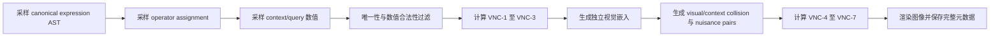

# VG-MNR：面向视觉必要性认证的机器数值推理基准

> 论文式研究方案 v0.1
>
> 状态：研究问题已收敛，生成器与像素级实验尚未实现
>
> 日期：2026-07-11

## 摘要

机器数值推理（Machine Number Reasoning, MNR）希望评价模型能否从视觉场景中归纳并执行算术规律。然而，图像中同时出现几何结构和数字，并不意味着最终准确率一定反映了视觉与算术的联合推理。我们对现有 MNR 论文及其开源生成器进行审计后发现：一道题中的三个 context、正确候选与错误候选共享同一几何底图；holistic 子任务可在已知数字槽位顺序时通过纯符号表达式搜索获得较高的候选选择率；analytical 子任务虽然引入视觉分组，但多数配置的每组仅包含两个数字，且错误候选通过局部数字扰动产生，从而允许不使用 context 的候选内部一致性解法。现有数据文件又只保存图像和最终标签，无法区分数值读取、视觉绑定、算式归纳、执行和候选排除等能力。因此，当前 MNR 的最终准确率是“视觉落地的算术程序归纳”的不充分代理。

本文拟提出 VG-MNR（Visually Grounded Machine Number Reasoning）。其核心不是增加更多装饰属性，而是让视觉关系成为算术程序的必要语法：包含关系定义作用域，连接关系定义计算图，方向关系定义操作数顺序，分组关系定义子表达式。算术运算符仍由多个 context 归纳，避免“某种颜色固定代表加法”一类任意 codebook。为从构造层面保证任务确实需要视觉，VG-MNR 为每道题计算 Visual Necessity Certificate（VNC）：完整信息下程序与答案必须唯一；移除视觉关系或移除 context 后必须存在多个可行答案；改变一条功能性视觉关系时答案必须改变；仅改变位置、尺寸或线型等无关渲染时答案必须保持不变。进一步地，hard split 为视觉消融与 context 消融分别构造 exact collision pairs，使消融后的输入完全相同而 gold answer 不同，从数据本身排除仅靠分布先验恢复唯一标签。该证书同时构成样本过滤条件、评价指标和反事实实验协议。VG-MNR 由可控的 latent program、完整的 scene graph 与 expression AST 元数据、开放式数值回答、组合泛化划分和阶段化诊断任务组成，旨在把“图像中有数字和形状”提升为具有可验证视觉依赖的算术程序推理。

## 1. 引言

抽象视觉推理要求模型从有限视觉证据中发现可迁移的关系，而视觉算术推理进一步要求这些关系能够支撑数值运算。MNS [1] 率先以程序化几何布局承载数字和算术表达式，MNR 与 DARR [2] 随后将缺失数字预测改为八选一规则匹配，并加入四则运算、括号、holistic/analytical interpretation 和更丰富的空间配置。这条研究路线的重要价值是把数值推理放入可控视觉环境，使视觉感知、关系归纳和算术执行可以在同一任务中研究。

然而，一个 benchmark 是否包含视觉输入，与视觉信息是否为正确回答所必需，是两个不同问题。现有 MNR 采用最终八选一准确率作为主要评价，但该指标并不说明模型使用了哪些信息。模型可能读取数字并搜索表达式，可能利用候选内部的一致性，也可能记忆固定槽位与配置模板。只要这些策略能够预测最终标签，标准准确率就无法区分它们与真正的视觉结构理解。这一问题属于 construct validity：可观测代理是完整图像上的最终答案准确率，目标构念却是视觉关系驱动的算术程序归纳，两者未被现有协议证明等价。

VisuLogic [7] 提供了重要的方法论启发。它没有把“题目中存在图像”直接视为视觉推理，而是通过 MLLM-description-to-LLM 实验检验文本描述能否替代图像。MathVerse [6] 也通过不同视觉信息量的题目版本研究模型是否真正使用图表。近期 VisualFLIP [11] 进一步使用最小语义扰动对，要求模型在关键视觉证据改变时同步翻转答案；StemBind [12] 则把 perception、rule 和 full answer 拆成共享视觉 stem 的阶段化问题。这些工作共同表明，可靠的视觉推理 benchmark 需要评价信息依赖和推理过程，而不能只报告最终准确率。

VG-MNR 将这一原则转化为可计算的数据生成约束。与 VisuLogic 的异质人工题目不同，MNR 的程序化生成器提供 latent program，因此可以在每道题生成时枚举所有可行程序，并形式化检验视觉关系是否使答案从多解变为唯一解。我们将这种逐样本约束称为 Visual Necessity Certificate。它使“视觉是必要的”不再只是数据集级经验观察，而成为每个样本都必须满足的可验证属性。

本文计划贡献如下：

1. 通过代码审计和符号求解器，揭示现有 MNR 的 layout-algebra factorized solvability，即视觉解析与算术匹配可以被弱耦合地分解，并量化 holistic number-only 与 analytical candidate-only 解法。
2. 提出 VG-MNR，使视觉结构显式定义 expression AST 的绑定、作用域和顺序，而四则运算符由 context 归纳，从任务机制上建立视觉与算术之间的人类可理解联系。
3. 提出 Visual Necessity Certificate，逐题验证完整输入唯一性、视觉消融多解性、context 消融多解性、exact collision、语义反事实敏感性和无关渲染不变性。
4. 建立开放式答案、完整过程元数据、组合 OOD split、配对干预指标和阶段化诊断协议，分别评价感知、绑定、规则归纳与算术执行。

## 2. 相关工作与研究空缺

### 2.1 机器数感与机器数值推理

MNS [1] 使用 And-Or Graph 生成 combination、composition 和 partition 等几何布局，并将数字填入布局槽位。算术表达式由 calculation tree 采样，包含 holistic 和 analytical 两类 interpretation。MNR/DARR [2] 延续该生成思想，并将任务改为：给定三个 context，从八个候选中选择与其共享算术表达式的一个。MNR 的优势是算术 latent 可控、问题数量充足且能够生成多种几何配置；其限制在于 layout 和 algebra 是 AOG 中近似独立的分支，几何结构主要决定槽位与分组，未逐题验证几何信息对最终标签是否必要。

VisNumBench [8] 从更广泛的视觉数感角度评价多模态模型，覆盖多个视觉数值属性和估计任务。CogAlign [9] 则分析视觉算术失败来自视觉编码还是语言解码，并利用视觉变换下的不变量进行训练。这些工作说明数值感知本身仍是重要难点，但它们没有解决 MNR 中“视觉结构如何因果性地指定算术程序”的任务定义问题。VG-MNR 因而将数值读取与程序绑定设计成可分离的配对 track，而不把所有误差重新压缩成一个最终分数。

### 2.2 抽象视觉推理与候选偏差

RAVEN [3] 以结构化 scene graph 和规则生成 Raven's Progressive Matrices，为可控抽象视觉推理奠定了基础。随后工作发现，原始 RAVEN 的负样本生成方式容易被答案集合偏差利用，RAVEN-FAIR [4] 因此修改候选构造。该历史与 MNR 高度相关：一个候选选择任务即便拥有正确的 latent rule，也可能因负样本生成机制而允许 context-free 或 candidate-only 解法。VG-MNR 将开放式数值答案设为主协议，并把多选候选降为兼容性协议，以避免选项生成成为主任务的决定性因素。

### 2.3 视觉中心的多模态推理评价

MathVerse [6] 通过六种不同信息量的视觉数学题版本分析模型是否真正读取图表。VisuLogic [7] 收集并人工审核了 1,000 道视觉逻辑题，将其划分为 quantitative、spatial、positional、attribute、stylistic 和 other 六类，并通过描述替代图像的基线说明关键视觉细节难以被文本捷径完整替代。VisualFLIP [11] 使用保持问题不变、最小改变关键证据的成对样本，并以 pair accuracy 与 Collapse Rate 测量预测是否随证据改变。StemBind [12] 则在相同视觉 stem 上分别提问 perception、rule 和 full task，以定位最终错误发生在哪一阶段。

VG-MNR 不直接复制这些 benchmark 的题面，而是继承其 evaluation philosophy。具体而言，VisuLogic 的 quantity、position 和 attribute taxonomy 被转化为可控视觉语法；description-only baseline 被转化为关系遮挡、数字袋和 caption-to-LLM 消融；VisualFLIP 的最小语义翻转被转化为 expression AST 的单边或单作用域干预；StemBind 的阶段化诊断被转化为 value、binding、operator 和 execution 四类共享样本任务。

### 2.4 研究空缺

| Benchmark | 算术 latent 可控 | 视觉必要性检验 | 逐样本反事实 | 过程级元数据 | 组合程序 OOD |
|---|---:|---:|---:|---:|---:|
| MNS [1] | 是 | 否 | 否 | 部分 | 否 |
| MNR/DARR [2] | 是 | 否 | 否 | 发布数据中否 | 仅配置级 |
| RAVEN family [3,4] | 非算术规则 | 部分 | 部分 | 是 | 部分 |
| MathVerse [6] | 否 | 数据集级版本对比 | 部分 | 否 | 否 |
| VisuLogic [7] | 否 | 数据集级描述消融 | 否 | 分类标签 | 否 |
| VisualFLIP [11] | 否 | 是 | 是 | 干预标签 | 否 |
| StemBind [12] | 否 | 阶段化诊断 | 否 | 是 | 否 |
| **VG-MNR（拟）** | **是** | **逐样本证书** | **是** | **完整 AST/scene graph** | **是** |

现有工作尚未同时满足三点：算术程序可控、视觉依赖可逐样本验证、程序组合泛化可系统划分。VG-MNR 的研究位置正是这三个条件的交集。

## 3. 重新审计现有 MNR

### 3.1 审计目标

本节不试图证明现有 MNR“完全不需要视觉”，而是检验更严格的问题：当前最终准确率是否足以识别模型进行了视觉驱动的算术推理。为此，我们把一题的求解过程拆为五个环节：

```text
图像感知 -> 数字读取 -> 视觉角色绑定 -> 表达式归纳 -> 算术执行/候选判别
```

若删除某个环节的信息后，标签仍能被高准确率恢复，则最终准确率不能单独证明模型掌握了该环节。

### 3.2 一题内的几何底图固定

`mnr_dataset/Drawing.py:79-140` 中的 `drawing_panels()` 首先绘制一次几何底图 `img`，随后将其深拷贝给六个正确 panel 和八个错误 panel。三个 context、正确候选与错误候选因而共享相同的形状、边界、位置和 analytical grouping。候选之间的主要变化来自数字列表及其表达式生成方式，而不是视觉规则本身。

这一事实不能单独推出“几何无用”，因为几何仍可能帮助确定数字顺序和分组。但它能够推出两个更窄且更可靠的结论。第一，MNR 不包含 VisuLogic/RAVEN 式的跨 panel 视觉关系变化；第二，候选之间的几何层本身没有判别信息，候选判别发生在数字与算术一致性层。

### 3.3 Holistic：较长算式与弱视觉依赖

Holistic 模式将一个 panel 的全部数字放入同一表达式。我们在不读取轮廓的条件下，使用真实生成器产生数字列表，并枚举固定槽位顺序下的全部 `+ - * /`、合法二叉括号结构与精确 Fraction 运算。规则只有在三个 context 中得到同一 1-99 整数时才被保留，候选按照被多少条 context-consistent 规则支持进行评分。

| Holistic slice | 样本数 | 规则数 | Version-space 中位数 | Number-only max-support | 至少一个错误项也被支持 |
|---|---:|---:|---:|---:|---:|
| 3 numbers | 1,000 | 32 | 2 | 81.4% | 44.2% |
| 4 numbers | 1,000 | 320 | 5 | 83.7% | 39.1% |

随机八选一为 12.5%。该结果是 exact-value、oracle-slot-order 的符号上界，不是 raw-image 模型结果；目前也只覆盖 3/4-number holistic slice，不代表全部 6/8-number 配置。它所支持的保守结论是：在已审计 slice 中，数字槽位与数值关系已经足以远高于随机地恢复标签，因此完整图像准确率不能自动归因于几何理解。

### 3.4 Analytical：视觉分组与简单局部算式

Analytical 模式先把数字分成若干 group，再让每个 group 使用同一表达式并得到相同常数：

$$
E(\mathbf{x}_{i,1})=E(\mathbf{x}_{i,2})=\cdots=E(\mathbf{x}_{i,p})=c.
$$

代码中没有运算符进一步组合不同 group 的输出。也就是说，视觉结构负责 partition，算术程序则在每个 group 内独立重复。145 个配置中有 85 个 analytical 配置，其算术规模如下：

| Panel 数字数 | Group 数 | 每组数字数 | 配置数 | 每组运算符数 |
|---:|---:|---:|---:|---:|
| 4 | 2 | 2 | 14 | 1 |
| 6 | 2 | 3 | 12 | 2 |
| 8 | 2 | 4 | 24 | 3 |
| 6 | 3 | 2 | 11 | 1 |
| 8 | 4 | 2 | 24 | 1 |

其中 49/85，即 57.6% 的 analytical 配置，每组只有两个数字，组内表达式仅包含一次运算。视觉分组最明显的配置，往往对应最短的算式，而不同 group 之间没有更高层的 arithmetic composition。这说明当前 benchmark 把“数学复杂性”和“视觉分组复杂性”分配给了不同子任务，没有保证二者在同一道题中同时成立。

### 3.5 Analytical candidate-only 审计

Analytical 的错误候选首先按正确表达式生成，再由 `mnr_dataset/Num_Arrange.py:1295-1326` 在显示阶段随机修改 1-2 个数字。我们使用真实生成器在五种 analytical signature 上各产生 1,000 题。候选内部评分只检查：是否存在一条表达式，使该候选的所有视觉 group 得到同一个 1-99 整数。它不使用三个 context。

| 数字数/Group 数 | 配置权重 | Candidate-only oracle | Context + candidate oracle |
|---|---:|---:|---:|
| 4/2 | 14 | 68.9% | 92.1% |
| 6/2 | 12 | 66.0% | 90.1% |
| 8/2 | 24 | 61.1% | 91.1% |
| 6/3 | 11 | 95.1% | 95.9% |
| 8/4 | 24 | 95.8% | 96.1% |
| **按 85 个配置加权** | **85** | **77.3%** | **93.2%** |

Candidate-only oracle 使用了精确数字与生成器真实 group order，因此不是可直接与视觉模型比较的 raw-image baseline。它仍然揭示了一个确定的标签属性：在 analytical 子任务中，存在一条完全不需要跨图归纳的高准确率求解路径。尤其当一个候选含三到四个二元 group 时，正确候选表现为多次重复同一局部等式，而错误候选的 1-2 个数字扰动会破坏这种内部一致性。

### 3.6 元数据与 split 不能诊断上述问题

`mnr_dataset/main.py:147-152` 发布的 `.npz` 仅保存：

```text
context_images
answer_set_images
correct_answer_image_index
```

数据中没有数字列表、数字坐标、视觉 grouping、operator list、expression tree、hidden constant、distractor type 或 scene graph。因此，标准协议只能测量最终八选一结果，不能判断错误来自 OCR、binding、operator induction 还是 execution，也不能验证成功是否依赖视觉。

Protocol I 在每个 configuration 内按样本编号进行 6:2:2 划分。Protocol II 按 145 个 configuration 划分训练、验证和测试集，能够测试未见几何配置，但没有显式留出 `visual structure x arithmetic program` 的特定组合。它不是针对视觉-算术组合泛化设计的 split。

### 3.7 审计结论与边界

目前证据支持以下结论：

1. 一题内的视觉底图固定，视觉关系不在 context 与候选间发生规则变化。
2. 已审计 holistic slice 存在高准确率 ordered-number symbolic solution。
3. analytical 中存在高准确率 candidate-only grouped-number solution。
4. 当前 metadata 和最终准确率无法区分这些求解机制。

目前证据不支持以下强结论：

1. 整个 MNR 完全不需要视觉。
2. raw-image 模型一定会达到 symbolic oracle 的成绩。
3. 所有模型当前都在利用候选捷径。
4. 现有 MNR 没有研究价值。

新的 benchmark 必须修复的是评价可识别性，而不是通过贬低旧数据集来制造动机。

## 4. 研究问题与核心假设

### 4.1 Proxy split

| 项目 | 定义 |
|---|---|
| Proxy A | 完整 MNR 图像上的最终答案准确率 |
| Construct B | 视觉关系落地的算术程序归纳与执行 |
| Failure regime R | candidate-only、number-only、relation removal、组合 OOD |
| Mechanism H | layout-algebra factorized solvability |
| Probe P | 符号 version-space、像素级 modality ablation、语义/无关干预对 |
| Minimal artifact O | 带 Visual Necessity Certificate 的可控 benchmark |

### 4.2 主研究问题

> **Can models induce and execute arithmetic programs whose binding structure is recoverable only from visual relations, rather than from ordered numbers, fixed templates, or answer-set consistency?**

对应的中文研究问题是：

> 模型能否归纳并执行一个只有通过视觉关系才能恢复绑定结构的算术程序，而不是依赖有序数字、固定模板或候选内部一致性？

### 4.3 子问题

1. **视觉必要性**：移除功能性视觉关系后，样本是否仍然存在唯一答案？
2. **Context 必要性**：只看 query 或候选自身，是否仍能确定隐藏算术程序？
3. **证据依赖性**：当一条功能性关系改变时，模型答案是否按 gold program 正确改变？
4. **无关不变性**：当位置、尺寸、方向或线型变化但程序不变时，模型是否保持答案？
5. **组合泛化**：模型能否把训练中见过的视觉语法与算术运算重组为未见程序？
6. **过程诊断**：模型失败来自 value reading、binding、operator induction 还是 execution？

### 4.4 可证伪假设

| 假设 | 预期证据 | 证伪条件 |
|---|---|---|
| H1：现有 MNR 准确率包含可分解捷径 | raw-image candidate-only/number-only 高于随机 | 强模型在所有消融中均接近随机，且完整模型依赖关系像素 |
| H2：VNC 能建立视觉必要性 | full symbolic oracle 唯一，no-visual oracle 多解 | no-visual solver 仍可逐题恢复唯一答案 |
| H3：标准 accuracy 高估证据依赖 | semantic pair accuracy 显著低于 single accuracy | 强模型在 single 与 pair 上同样稳定 |
| H4：模型难以组合视觉语法与算术程序 | composition-OOD 明显低于 IID | OOD 与 IID 差距很小且无程序类型差异 |
| H5：阶段化标签能定位失败 | stage score 能预测 full-task error | perception/rule/execution 分数与最终错误无关 |

当前成熟度为 Yangshi research ladder 的 **L3：机制假设**。我们已有 diagnostic evidence，并给出了能预测指标、干预、负控和证伪条件的机制，但尚未实现最小 artifact，因此不能进入 paper-ready 阶段。

## 5. VG-MNR 任务定义

### 5.1 任务形式

每题由三个 solved context 和一个 query 构成：

$$
\mathcal{C}=\{(G_i,\mathbf{x}_i,y_i)\}_{i=1}^{3}, \qquad
q=(G_q,\mathbf{x}_q,?).
$$

其中，$G_i$ 是功能性视觉关系图，$\mathbf{x}_i$ 是叶节点数值，$y_i$ 是 context 的结果。三个 context 与 query 共享一个 latent arithmetic program，但每个 panel 使用独立的空间嵌入和叶节点位置。模型需要从 context 中归纳内部节点的四则运算，并沿 query 的视觉关系恢复 binding、scope 和 operand order，最终输出整数 $y_q$。

主协议采用开放式数值输出：

```text
Input: 3 solved visual programs + 1 query visual program
Output: one integer in [1, 99]
```

开放式输出移除了 candidate-only 选择捷径，也使答案空间不受人工 distractor 分布控制。为与 MNR/RAVEN 模型兼容，可以提供辅助 8-way 协议，但论文主结果以 open-ended accuracy 和 paired metrics 为准。

### 5.2 Latent arithmetic program

基础程序使用有序二叉表达式树：

$$
P ::= v \mid P+P \mid P-P \mid P\times P \mid P\div P,
$$

其中叶节点 $v\in\{1,\ldots,9\}$，所有中间结果与最终结果限制在 1-99，除法要求整除，减法默认保持正整数。MVP 从三个叶节点、两个内部节点开始；正式版本扩展到 3-5 个叶节点、2-4 层深度和多种非平衡 tree topology。

运算符不直接显示在图中。三个 context 的输入和结果用于确定内部节点的 operator assignment。生成器枚举所有合法 operator assignments，只保留完整视觉信息下 latent program 唯一的样本。

### 5.3 视觉语法定义 expression AST

视觉设计只保留功能性关系，不增加与推理无关的装饰。核心视觉原语如下：

| 视觉原语 | 程序语义 | 是否可被单独遮挡 |
|---|---|---:|
| containment / nested boundary | 子树与括号作用域 | 是 |
| directed connectivity | parent-child 数据流 | 是 |
| ordered ports / arrow direction | 左右操作数顺序 | 是 |
| closed grouping | 子表达式成员关系 | 是 |
| root marker | 最终输出位置 | 是 |

视觉原语只表达算式语法，不任意表达四则运算符。例如，圆形不固定表示加法，黑色不固定表示乘法。运算符由 context 的数值关系归纳；视觉图只回答“谁先和谁算、结果流向哪里、左右顺序是什么”。这种设计等价于人类使用括号、树和流程图表示表达式，视觉结构改变导致算式结构改变具有明确语义来源。

### 5.4 随机空间嵌入

当前 MNR 的固定槽位使位置本身可能成为程序角色。VG-MNR 对每个 context 和 query 独立采样 planar embedding：

1. 叶节点不绑定全局上/下/左/右角色。
2. 同一程序在不同 panel 中随机旋转、镜像、平移和交换局部布局。
3. 操作数顺序只由有向边或 ordered port 确定，不由绝对坐标确定。
4. 所有对象满足最小间距、边界距离和不重叠约束。
5. 功能性关系与无关渲染分别保存 mask，支持精确消融。

因此，在删除边和边界后，数字及其坐标不再提供稳定的角色映射。

### 5.5 配对数值渲染

核心研究对象是视觉 binding，而不是 fuzzy value decoding。为避免重新混淆两个问题，同一 latent sample 提供配对渲染：

| Track | 叶节点表示 | 目的 |
|---|---|---|
| Symbolic-value | 清晰数字 1-9 | 隔离视觉结构与程序归纳 |
| Non-symbolic quantity | 1-9 个同类对象 | 评价视觉数感与程序推理的组合 |

两种 track 共享相同 sample ID、AST、operator assignment、context 和 query answer。二者性能差值用于估计 value perception bottleneck。size、color lightness 等连续 fuzzy 属性不进入 v1 核心语义，只能作为后续 robustness/OOD rendering；否则无法判断失败来自视觉量化还是程序归纳。

### 5.6 示例的语义解释

设某题的视觉图先把 $a,b$ 绑定为一个子表达式，再把该结果传给与 $c$ 相连的根节点。三个 context 的结果使唯一 operator assignment 为：

$$
P(a,b,c)=(a+b)\times c.
$$

query 中即使 $a,b,c$ 被放到不同绝对位置，模型也必须沿边界和连接恢复同一 AST。若 semantic intervention 把 $b,c$ 绑定为内部子树，同时保持 internal/root operator assignment，则程序变为：

$$
P_{\mathrm{sem}}(a,b,c)=a\times(b+c)
$$

或对应的有序树变体。该变化与移动括号等价，而不是“同一个颜色突然变成另一个运算”。生成器只保留 $P(\mathbf{x}_q)\neq P_{\mathrm{sem}}(\mathbf{x}_q)$ 的反事实对。

## 6. Visual Necessity Certificate

### 6.1 完整 version-space

给定 context $\mathcal{C}$，令 $\Omega$ 为合法 operator assignments，$F(G,\mathbf{x};\omega)$ 为按照视觉图 $G$ 绑定并执行程序的结果。完整 version-space 为：

$$
\mathcal{V}_{\mathrm{full}}(\mathcal{C})=
\left\{\omega\in\Omega\;\middle|\;
\forall i, F(G_i,\mathbf{x}_i;\omega)=y_i\right\}.
$$

基础版本要求：

$$
|\mathcal{V}_{\mathrm{full}}(\mathcal{C})|=1.
$$

若多条程序在 context 上数值等价，即使 query 输出恰好相同，也优先拒绝该样本。这样可以支持 operator/program recovery，而不仅是 answer recovery。

### 6.2 视觉消融 version-space

定义 $A_{-\mathrm{vis}}(G)$ 删除功能性边界、连接、方向和 root marker，仅保留数值及无关渲染。消融后，求解器需要同时枚举可能的绑定树 $T'$ 与运算符 $\omega$。其 query 可行答案集合记为：

$$
\mathcal{Y}_{-\mathrm{vis}}=
\left\{F(T',\mathbf{x}_q;\omega)\;\middle|\;
(T',\omega)\text{ 与消融后的 contexts 一致}\right\}.
$$

视觉必要性条件为：

$$
|\mathcal{Y}_{-\mathrm{vis}}|\ge 2.
$$

这不是要求 no-visual 模型“表现较差”，而是要求在预定义的程序假设空间内，no-visual 输入不能唯一决定 gold answer。若数字袋、数字加坐标或 caption 能恢复唯一答案，该样本不能进入 benchmark 主测试集。仅有 version-space 多解仍可能留下数据先验，因此 hard split 还需满足下一小节定义的 exact collision 条件。

### 6.3 Context 消融 version-space

只给定 query 的视觉图与数值时，运算符尚未由 context 归纳。定义：

$$
\mathcal{Y}_{-\mathrm{ctx}}=
\left\{F(G_q,\mathbf{x}_q;\omega)\;\middle|\;\omega\in\Omega\right\}.
$$

Context 必要性条件为：

$$
|\mathcal{Y}_{-\mathrm{ctx}}|\ge 2.
$$

该条件直接排除 candidate-only 与 query-internal-consistency 解法。对于辅助多选协议，还需保证只看候选集合时各选项的 program consistency 和低阶统计相匹配。

### 6.4 Exact collision pairs

Version-space 多解说明信息不足，但不直接限制一个利用训练分布先验的模型。为建立更强的必要性测试，hard split 为每个样本生成两类 exact collision。

**Visual collision pair** 保持叶节点数值、绝对坐标、无关风格和 context 不变，只改变功能性边或作用域。设视觉消融函数为 $A_{-\mathrm{vis}}$，要求：

$$
A_{-\mathrm{vis}}(q)=A_{-\mathrm{vis}}(q^{\mathrm{vis\text{-}cf}}),
\qquad y_q\neq y_q^{\mathrm{vis\text{-}cf}}.
$$

也就是说，关系遮挡后的两道题在像素或结构化输入上完全相同，但 gold answer 相反。任何只使用消融输入的确定性求解器都不可能同时做对该 pair。

**Context collision pair** 保持 query 图像、数值和所有 query 元数据完全相同，只替换 solved contexts，使另一组唯一 operator assignment 被归纳出来，并要求：

$$
q=q^{\mathrm{ctx\text{-}cf}},
\qquad y_q\neq y_q^{\mathrm{ctx\text{-}cf}}.
$$

因此，只看 query 的模型面对的是完全相同的输入和两个不同标签。该设计比 query-only version-space 多解更强，因为它直接阻止模型用答案频率或程序先验在 pair 上获得满分。

Exact collision 不意味着单题随机准确率必然固定为 50%，因为开放式答案可能包含多个 collision member；论文应报告 collision-set size 和理论最优消融上界。对于二元 pair，no-visual 或 no-context 的 deterministic pair accuracy 上界为 50%。

### 6.5 语义干预与无关干预

对每个基础样本生成两类配对样本。

**语义干预** $I_{\mathrm{sem}}$ 只改变一项功能性结构，例如移动一条 parent-child edge、改变一个 enclosure 的 scope 或交换有向端口。保持叶节点数值、视觉风格和 operator assignment 不变，并要求：

$$
y_q^{\mathrm{sem}}\neq y_q.
$$

**无关干预** $I_{\mathrm{nui}}$ 只改变位置、旋转、镜像、尺寸、线宽或边界形状，但保持 canonical AST 和 operator assignment 不变，并要求：

$$
y_q^{\mathrm{nui}}=y_q.
$$

两类 pair 共同区分“对关键视觉证据敏感”和“对无关像素变化鲁棒”。仅有前者可能导致模型对所有变化都敏感，仅有后者则可能让模型忽略视觉。

语义干预应优先与 visual collision 共用同一对样本：功能关系改变使 gold 翻转，而遮挡功能关系后两者完全相同。这样一个 pair 同时测量关系的必要性和模型的证据敏感性。

### 6.6 VNC 判定

一个样本进入 benchmark hard split 前必须满足：

```text
VNC-1  Full program uniqueness
VNC-2  No-visual answer multiplicity
VNC-3  No-context answer multiplicity
VNC-4  Visual-semantic collision: identical relation-ablated input, different gold
VNC-5  Context collision: identical query, different contexts and gold
VNC-6  Nuisance intervention preserves the gold answer
VNC-7  Exact scene-graph oracle executes without error
```

VNC 是本文的核心 operational object。它既解释现有 benchmark 的代理失效，也直接改变新数据集的生成算法、评价指标、消融实验和样本发布格式。

## 7. 数据生成方法

### 7.1 生成流水线



生成顺序不能先渲染再补标签。latent program、version-space 和干预关系是样本的主体，图像只是其可控观测。

### 7.2 程序与数值采样

1. 按目标 split 采样 leaf count、tree topology 和 depth。
2. 平衡内部节点的 `+ - * /`，并记录 commutative/non-commutative 结构。
3. 采样三个 context 和一个 query 的叶节点值。
4. 通过 exact Fraction evaluator 保证整除、正整数和 1-99 范围。
5. 枚举 operator assignments，要求 full program 唯一。
6. 枚举视觉消融下可能的 tree binding，要求 no-visual 多解。
7. 枚举 query-only 的 operator assignments，要求 no-context 多解。
8. 为同一 relation-ablated observation 生成不同 gold 的 visual collision。
9. 为同一 query 生成不同 context-induced program 与 gold 的 context collision。

为避免特殊数值造成伪唯一性，需要控制重复数字、0/1 乘除退化、交换律等价和不同程序的偶然数值碰撞。程序唯一性过滤必须基于 canonical AST，而不能只比较表达式字符串。

### 7.3 视觉渲染

MVP 锁定为单色、无装饰的 directed-tree 视觉语法，不在第一版同时比较多种节点形状。所有计算节点使用同尺寸空心圆，节点类型由内容与图拓扑区分，而不是由形状区分：

| 元素 | MVP 固定样式 | 功能 |
|---|---|---|
| value node | 直径 28-32 px 的空心圆，内部为数字 | 输入值 |
| internal node | 同尺寸空心圆，内部为空 | 隐藏运算节点 |
| root node | 同尺寸空心圆，内部为 context 结果或 query 的 `?` | 输出位置 |
| functional edge | 2 px 黑色直线与 5-6 px 箭头 | 数据流和操作数顺序 |
| background | 纯白、无外框 | 无语义背景 |

一个三叶节点 panel 的逻辑骨架为：

```text
(a) ---\
        +--> ( ) ---\
(b) ---/             +--> (result / ?)
(c) ----------------/
```

实际实现中，$a,b$ 共同指向同一个 internal node，$c$ 直接指向 root。圆形本身不编码 `+ - * /`，内部节点的运算只能由 context 的数值与结果归纳。所有节点保持相同尺寸，避免模型通过大小识别 leaf、internal 或 root role。

具体渲染约束如下：

1. 画布固定从 160 x 160 开始，图结构占画布约 70%-80%，外边距不小于 12 px。
2. root node 保持在右侧以提供基本阅读方向；三个 value node 在左侧独立采样并随机交换位置。
3. 哪两个 value 先连接由 graph sampling 决定，不能由上/下或绝对坐标决定。
4. context 与 query 分别重新采样节点位置，删除 functional edges 后坐标不能稳定预测角色。
5. 边不能穿过节点，节点不能重叠，MVP 中边尽量不交叉；数字与圆边保持可读间距。
6. 不使用填充色、灰度、额外边界、三角形、方形、六边形、大小变化或线宽变化编码规则。
7. 同时输出 raster image、SVG/vector scene、functional-edge mask 和 value-node mask。

多种视觉语法应分阶段加入。第一阶段只实现上述空心圆 directed tree；第二阶段才加入与其表达同一 canonical AST 的 nested enclosure；第三阶段再考虑 ordered partition。不能在核心机制未通过 VNC 与 human study 前加入大量形状或连续属性。

### 7.4 多选兼容协议

辅助 8-way 协议的 distractor 必须由明确错误机制生成：

| Distractor | 对应错误 |
|---|---|
| wrong binding | 使用错误子树或 grouping |
| wrong scope | 忽略/移动括号 |
| wrong order | 交换非交换操作数 |
| wrong operator | 一个内部节点运算符错误 |
| partial execution | 只执行内层子表达式 |
| left-to-right | 忽略 AST，机械从左到右 |
| arithmetic slip | 正确程序下的局部计算错误 |

所有选项采用相同显示形式，只显示候选数值，不生成带不同局部统计的候选图。每题保存 distractor provenance，并通过 candidate-only solver 检查答案集合本身不能识别 gold。

### 7.5 元数据 schema

每题至少保存：

```json
{
  "sample_id": "...",
  "pair_id": "...",
  "collision_set_id": "...",
  "split_axes": {
    "topology": "...",
    "operator_composition": "...",
    "visual_grammar": "...",
    "render_style": "..."
  },
  "program": {
    "canonical_ast": "...",
    "operators": ["+", "*"],
    "depth": 2,
    "leaf_count": 3
  },
  "contexts": [
    {"values": [2, 3, 4], "answer": 20, "scene_graph": "..."}
  ],
  "query": {
    "values": [4, 2, 3],
    "answer": 18,
    "scene_graph": "..."
  },
  "vnc": {
    "full_program_count": 1,
    "no_visual_answer_count": 4,
    "no_context_answer_count": 7,
    "visual_collision_exact": true,
    "context_collision_exact": true,
    "semantic_flip": true,
    "nuisance_invariant": true
  },
  "intervention": {
    "type": "semantic_edge_move",
    "changed_relation": "..."
  }
}
```

图像文件仍可使用 `.npz`，但 JSONL 元数据必须成为正式发布的一部分。scene graph、AST 和 masks 使研究者能够构造 oracle、消融与阶段化任务，而不是依赖 OCR 反推生成过程。

### 7.6 数据规模与质量控制

建议的 full version 规模为：

| 子集 | 计划规模 | 用途 |
|---|---:|---|
| Procedural train | 100,000 | 训练与方法开发 |
| Validation | 10,000 | 选择模型与阈值 |
| IID test | 10,000 | 标准性能 |
| 每个 OOD split | 5,000-10,000 | 组合与渲染泛化 |
| Human-audited core | 1,000 | MLLM leaderboard 与人工基线 |

质量控制包括：程序合法性、VNC、图像渲染、重复检测、答案平衡、数值分布、视觉可读性和人工检查。Human-audited core 参考 VisuLogic 的逐题检查，但应额外记录 human agreement、平均作答时间和错误类型。若 human accuracy 低或 inter-annotator agreement 不足，优先修订视觉语法，而不是把低人类表现包装成任务困难。

## 8. 数据划分与评价协议

### 8.1 Split 设计

| Split | Train 中可见 | Test 中 held out | 研究问题 |
|---|---|---|---|
| IID | 全部因素同分布 | 新数值实例 | 基本拟合能力 |
| Layout-OOD | AST 与运算相同 | 新空间嵌入/方向 | 是否记忆绝对位置 |
| Visual-Grammar-OOD | 一种 AST 可视化 | 新的等价可视化 | 是否抽象理解程序结构 |
| Topology-OOD | 部分 tree shapes | 未见 tree topology | 是否泛化到新绑定结构 |
| Operator-Composition-OOD | 各运算符单独见过 | 特定内部/根运算组合 | 是否组合算术规则 |
| Cross-Product-OOD | 视觉语法和运算均见过 | 未见 `grammar x program` 配对 | 是否真正联合组合 |
| Value-OOD | 受限叶值/结果区间 | 新数值范围 | 是否依赖数值记忆 |
| Rendering-OOD | Symbolic 或一种风格 | quantity/新字体/新线型 | 感知鲁棒性 |

正式主张“组合泛化”必须以 canonical latent hash 划分，保证 test program 或因素配对没有通过不同渲染泄漏到 train。

### 8.2 主指标

1. **Open-ended Accuracy**：完整任务数值答案准确率。
2. **Program Recovery**：预测 AST binding 与内部 operator assignment 的准确率。
3. **Visual-Semantic Collision Pair Accuracy**：关系反事实两侧均正确的比例。
4. **Context Collision Pair Accuracy**：相同 query、不同 context 的两侧均正确的比例。
5. **Collapse Rate**：gold 已翻转时，模型仍输出同一非空答案的比例，参考 VisualFLIP [11]。
6. **Nuisance Consistency**：基础样本与 nuisance pair 同时正确且答案一致的比例。
7. **Stage Accuracy**：value、binding、operator、execution 四阶段准确率。

### 8.3 必要性 gap

定义完整输入与视觉消融输入的差异：

$$
\mathrm{VNG}=\mathrm{Acc}_{\mathrm{full}}-\mathrm{Acc}_{-\mathrm{vis}},
$$

以及完整输入与 context 消融输入的差异：

$$
\mathrm{CNG}=\mathrm{Acc}_{\mathrm{full}}-\mathrm{Acc}_{-\mathrm{ctx}}.
$$

VNG/CNG 不能脱离 full accuracy 单独解释。若 full 和 ablation 都很低，大 gap 不代表良好推理；若 full 高但 semantic pair accuracy 低，则模型可能仍没有跟随关键证据。因此主表必须联合报告 full accuracy、pair accuracy、collapse rate 和 nuisance consistency。

### 8.4 阶段化诊断

同一 latent sample 派生四个共享证据问题：

```text
Value:     每个叶节点的值是什么？
Binding:   哪些叶节点先组成子表达式？顺序是什么？
Operator:  context 支持哪些内部运算符？
Execution: 按已恢复程序计算 query 结果。
```

这一设计借鉴 StemBind [12]，但标签由生成器自动给出。通过共享 sample ID，可以分析“看对但绑错”“规则对但执行错”以及“最终猜对但过程错”等现象。

## 9. 实验计划

### 9.1 必须包含的 baseline panel

| Baseline | 输入 | 研究作用 | 可以证伪什么 |
|---|---|---|---|
| Random/majority | 无 | 下界 | 答案分布是否泄漏 |
| Full symbolic oracle | AST + exact values | 正确性上界 | 生成器或标签是否有 bug |
| No-visual symbolic oracle | value bag/coordinates | VNC 检查 | 视觉结构是否为唯一解所必需 |
| Query-only oracle | query graph + values | context necessity | 是否仍有 candidate-only 解法 |
| OCR + coordinates | 数字与位置 | 槽位捷径 | 绝对位置是否编码角色 |
| Scene-graph solver | 自动/真实 scene graph | perception 上界 | 难点是否仅为图像解析 |
| Caption-to-LLM | 自动描述 | VisuLogic-style shortcut probe | 文本是否可替代关系像素 |
| Standard AVR models | raw image | 与 MNR/RAVEN 对比 | 传统架构是否足够 |
| MLLMs | raw image + prompt | 当前模型能力 | 规模与 CoT 是否解决 grounding |

### 9.2 现有 MNR 的诊断实验

在正式构建新数据集前，必须把 symbolic audit 扩展为 raw-image baseline：

1. Candidate-only：只给八个候选，不给 context。
2. Number-only：保留数字像素及坐标，删除几何轮廓。
3. Geometry-only：遮掉数字，作为负控。
4. Shuffled-context：保留候选，随机替换 context。
5. Relation-mask：只遮挡 analytical grouping 的关键边界。
6. 按 holistic/analytical、slot count、configuration 分层报告。

所有审计必须整理为版本控制内的可执行脚本，固定随机种子，并输出逐 signature 的 JSON/CSV 报告与 bootstrap confidence interval；正式论文不能只保留对话中产生的汇总数字。

只有 raw-image 结果复现 generator-level 的趋势后，论文才能使用“模型实际利用捷径”的表述；否则只能说“标签允许捷径”。

### 9.3 VG-MNR 的机制实验

实验应按机制顺序执行：

1. **Certificate validation**：full oracle 100%，no-visual/no-context 每题多解，collision pair 的消融输入逐像素或逐字段相同。
2. **Diagnostic probe**：full input 与 modality ablation 的差异。
3. **Semantic stress**：single accuracy 与 semantic pair accuracy 的差距。
4. **Nuisance negative control**：改变无关渲染不应改变答案。
5. **Composition stress**：IID、Topology-OOD、Operator-OOD 和 Cross-Product-OOD。
6. **Stage diagnosis**：value/binding/operator/execution 与 full error 的对应关系。
7. **Rendering comparison**：symbolic-value 与 non-symbolic quantity paired track。
8. **Human study**：无提示、有规则提示和 scene-graph 提示三种条件。

### 9.4 关键 ablation

| Ablation | 删除内容 | 预期结果 |
|---|---|---|
| w/o VNC-2 | 不检查 no-visual 多解 | number-only 性能上升 |
| w/o VNC-3 | 不检查 no-context 多解 | query-only 性能上升 |
| w/o collision pairs | 仅保留 version-space 多解 | 消融模型可能利用程序先验 |
| w/o semantic pairs | 仅报告 single accuracy | 无法发现 answer collapse |
| fixed layout | 取消独立空间嵌入 | coordinate baseline 上升 |
| arbitrary operator codebook | 颜色/形状映射四则运算 | 映射记忆替代程序归纳 |
| no program uniqueness | 允许多条 context-consistent program | 标签可识别性下降 |
| multiple-choice only | 删除 open-ended 协议 | candidate bias 风险上升 |

## 10. 预期论文论证

### 10.1 一句话 thesis

> Although MNR accuracy is commonly interpreted as visual arithmetic reasoning, current generation permits factorized solutions based on ordered numbers and candidate-internal consistency; VG-MNR makes visual grounding identifiable by certifying, for every sample, that visual relations and contexts are both necessary to recover a unique arithmetic program.

中文版本：

> 虽然 MNR 准确率通常被解释为视觉算术推理能力，现有生成机制却允许基于有序数字和候选内部一致性的可分解解法；VG-MNR 通过逐题认证视觉关系与 context 对唯一算术程序均为必要条件，使视觉 grounding 成为可识别的评价对象。

### 10.2 Teaser figure 设计

第一张图应只讲一个信息：相同 latent values 下，旧 MNR 的完整图像与 number-only/candidate-only 仍可得到同一标签；VG-MNR 删除视觉关系后出现多个可行答案，而单条 semantic edge intervention 会确定性翻转 gold。建议四栏：

```text
(a) Existing MNR full sample
(b) Shortcut-preserving ablation
(c) VG-MNR full sample with unique program
(d) Semantic intervention with flipped answer
```

图中同时标注 symbolic version-space size，使视觉必要性成为可见、可量化的第一印象，而不是只展示几张漂亮样例。

### 10.3 论文贡献层级

| Claim tier | 可用表述 | 所需证据 |
|---|---|---|
| Diagnostic | 现有 MNR 标签允许 factorized solution | 代码审计 + symbolic/raw-image probes |
| Mechanism | layout-algebra separability 解释 proxy failure | modality ablation + 分层分析 |
| Artifact | VNC 逐题保证特定信息必要性 | exact solver + certificate statistics |
| Evaluation | paired/stage metrics 揭示 accuracy 隐藏的失败 | MLLM/AVR model suite |
| Generalization | 模型在视觉-算术组合 OOD 上退化 | canonical held-out splits |

### 10.4 与 VisuLogic 的准确关系

论文不能写成“把 VisuLogic 搬到 MNR”。更准确的定位是：

```text
VisuLogic:
通过 caption-to-LLM 的经验对照，强调 vision-centric evaluation。

VG-MNR:
利用可控 latent arithmetic program，把 vision-centricity
转化为逐样本可证明的必要性约束和反事实协议。
```

因此，我们借鉴的是研究标准，不是图片样式或类别列表。

## 11. 风险、替代解释与修复

### 11.1 “这只是图形化括号”

这是最可能的 reviewer 质疑。基础版本确实把 visual graph 用作 expression syntax，但这不是缺点本身，而是为了建立最小、可验证的人类直觉。修复方式不是立即加入更多属性，而是证明：

1. 不同视觉语法可以表达同一 canonical AST。
2. 模型需要跨 visual grammar 泛化，而非识别固定括号模板。
3. binding、scope、order 分别有独立干预和错误标签。
4. scene-graph oracle 容易而 raw-image model 仍有系统差距。

若多种 grammar 仍只被模型当作固定符号 lookup，则需要再引入 VisuLogic-style 的自然 grouping/flow rendering，而不是 fuzzy 数值属性。

### 11.2 “数字仍然是显式的”

显式数字 track 是刻意设置的控制变量，用于隔离 visual binding。论文不应声称它测量完整人类数感。Non-symbolic quantity paired track 才测试数值感知与程序推理的组合。若直接删除数字并只用连续 size/color，任何失败都无法区分 value decoding 与 arithmetic induction，反而削弱主研究问题。

### 11.3 “Synthetic benchmark 不代表真实视觉推理”

VG-MNR 的目标不是覆盖现实世界视觉数学，而是提供机制可验证的 stress test。需要通过三个补充降低 synthetic risk：多视觉语法、human-audited core、与 MathVerse/VisuLogic/VisualFLIP 上模型行为的相关分析。不能把合成数据上的成绩直接外推为通用视觉智能。

### 11.4 “VNC 只约束信息，不约束模型实际使用方式”

该质疑成立。VNC 保证没有视觉时答案不唯一，但不能证明模型在完整图像上形成了人类式表征。因此必须联合 semantic pair、nuisance pair、stage prediction 和过程解释。论文只能主张 benchmark 排除了已定义的 exact shortcuts，而不能主张它保证“真正理解”。

### 11.5 “三条 context 不足以唯一归纳四则运算”

生成器不假设三条 context 总能唯一识别，而是显式枚举 version-space 并拒绝多解样本。需要报告拒绝率、各 program 的保留率和是否引入分布偏差。若某些复杂程序难以用三个 context 唯一识别，可以提供 3-context 与 5-context 两档，而不能通过任意 hint 暗示答案。

## 12. 最小可行版本与推进门槛

### 12.1 一周 MVP

第一周只实现：

```text
3 leaves
2 internal nodes
operators in {+, -, *, /}
3 solved contexts + 1 open-ended query
1 directed-tree visual grammar
independent panel embeddings
VNC-1/2/3 exact solver
visual collision / semantic edge-move pair
context collision pair
nuisance position-jitter pair
JSONL metadata + raster image
versioned audit/generator scripts + fixed seeds
```

目标生成 20,000 个候选 latent sample，而不是预先承诺全部通过率。首先统计：

1. full program uniqueness rate；
2. no-visual/no-context rejection rate；
3. 各 operator composition 的保留率；
4. visual/context collision 构造成功率；
5. semantic flip 成功率；
6. 图像重叠与可读性失败率；
7. symbolic oracle 是否 100%。

### 12.2 Go/No-Go 门槛

只有满足以下条件才扩展四叶节点和多 visual grammar：

| 门槛 | 通过标准 |
|---|---|
| Certificate feasibility | 至少 20% 候选样本能通过 VNC，且程序分布可平衡 |
| Oracle correctness | full scene-graph oracle 100% |
| Shortcut rejection | no-visual/no-context 无唯一答案 |
| Human intuition | 小规模人工正确率高、规则解释一致 |
| Pixel feasibility | 简单视觉模型显著高于随机但未饱和 |
| Pair validity | collision 输入严格相同、semantic gold 翻转、nuisance gold 不变均为 100% |

若 no-visual version-space 经常唯一，则视觉语法或数值采样没有建立必要性，需要重做 generator。若人类不能稳定理解图，说明视觉语法不自然，同样不能通过增加数据量解决。

## 13. Claim-Evidence Ledger

| Claim | 当前证据 | 状态 | 允许表述 |
|---|---|---|---|
| 一题内几何底图被复制 | `Drawing.py` 代码 | supported | “生成器在一道题内复用几何底图” |
| 3/4-number holistic 存在 number-only 解法 | 2,000 题 symbolic audit | supported, narrow | “在已审计 slice 中” |
| analytical 存在 candidate-only 解法 | 5,000 题 grouped symbolic audit | supported as oracle | “标签允许 context-free symbolic solution” |
| raw-image 模型实际利用捷径 | 尚无像素实验 | needs probe | 暂不能写入摘要 |
| MNR 完全不需要视觉 | 证据不支持 | forbidden | 不得使用 |
| VNC 能逐题排除定义的消融捷径 | 形式化完成，代码未实现 | needs implementation | “we propose/plan” |
| VG-MNR 提升视觉 grounding | 尚无模型结果 | needs evidence | 暂不能使用 |
| 现有 MLLM 在 VG-MNR 上失败 | 尚无数据 | forbidden | 暂不能使用 |
| VG-MNR 是首个此类 benchmark | 未完成系统 novelty review | forbidden | 不使用 “first/novel” |
| Pair metrics 比 accuracy 更有诊断性 | VisualFLIP/StemBind 支持，需本任务验证 | needs evidence | 可作为假设 |

## 14. 论文反向提纲

| Section | 唯一信息 |
|---|---|
| Abstract | MNR accuracy 不可识别视觉 grounding；VNC 使必要性逐题可验证 |
| Introduction | 从“包含视觉”推进到“视觉因果必要” |
| Related Work | MNR 的可控算术与 vision-centric benchmark 的必要性测试尚未结合 |
| Diagnostic | layout-algebra separability 通过 candidate/number-only probe 可见 |
| Method/Dataset | visual AST + context-induced operators + necessity-certified generation |
| Experiments | full、ablation、pair、stage、OOD 五层证据围绕同一机制 |
| Discussion | VNC 排除定义的捷径，但不等价于保证人类式理解 |
| Conclusion | benchmark 应报告证据依赖，而不只报告最终答案 |

全文必须保持三个对象一致：

```text
Research object: visually necessary arithmetic program binding
Evidence object: version-space certificate and paired interventions
Writing object: MNR accuracy does not identify visual grounding
```

## 15. 当前裁决

本方向值得进入最小实现，但尚不适合直接写完整 paper 或生成大规模数据。原因是 proxy failure 已有代码和符号证据，mechanism、metric、artifact 和 falsifier 已对齐；同时，最关键的 raw-image audit、VNC generator 和 human intuition 尚未验证。

当前最合理的研究推进顺序是：

```text
复现并扩展现有 MNR 的像素级 shortcut audit
-> 实现三叶节点 VNC generator
-> 做 100-200 题人工可读性检查
-> 跑 symbolic/pixel baseline panel
-> 决定是否扩展 topology 和 visual grammar
-> 完成 novelty review 后再锁定题目与摘要
```

不再优先推进以下分支：

1. 用 CIFAR/Icon 类别任意映射数值。
2. 用 color/size 等 fuzzy 属性同时承担数值与角色。
3. 先做复杂四区布局，再寻找研究问题。
4. 继续使用局部数字扰动生成主要错误候选。
5. 仅凭“模型准确率低”声称 benchmark 更好。

## 16. 审稿式自检

### 16.1 五维检查

| 维度 | 当前判断 | 状态 | 下一项硬证据 |
|---|---|---|---|
| Contribution | Proxy failure、VNC 与 collision-pair artifact 已形成统一对象，但 novelty 尚未系统核查 | needs revision | 对 VisualFLIP、StemBind、MathVerse 及 necessity-certified generation 做完整 novelty matrix |
| Writing clarity | 研究问题、形式化和生成流程已可反向概括；仍缺真实 teaser/sample | pass at proposal level | 一张 base/collision/nuisance 三联图 |
| Experimental strength | 只有 generator-level symbolic audit，没有 raw-image 或新 benchmark 结果 | needs new experiment | 现有 MNR 像素消融与三叶 VG-MNR baseline panel |
| Evaluation completeness | baseline、ablation、OOD、human study 和负控已规划 | pass as plan | 实现后检查每项 claim 是否有对应表格 |
| Method soundness | Version-space 思路明确，但 collision 构造成功率与分布偏差未知 | needs new experiment | exact solver、拒绝率统计和 100-200 题 human pilot |

### 16.2 当前最高拒稿风险

1. **Novelty overlap**：VisualFLIP 已提出 evidence-flipping pairs，StemBind 已提出阶段化诊断。我们的区别必须落在 arithmetic program、逐样本 version-space certificate 和 exact collision generation，而不能只强调 paired evaluation。
2. **Task trivialization**：若 directed tree 过于接近显式计算图，reviewer 可能认为任务只是 OCR + graph parsing。需要通过 operator induction、no-context collision 和 Visual-Grammar-OOD 证明其不等同于读取现成算式。
3. **Selection bias from certification**：VNC 可能大量保留某些运算符或数值模式。必须报告候选到保留样本的完整漏斗、拒绝原因和重加权策略。
4. **Human intuition**：形式上唯一不等于人类自然。规则说明前后的 human accuracy、agreement 和时间必须成为质量门槛。
5. **Unsupported model claim**：在 raw-image probe 完成前，摘要只能说现有标签“允许”捷径，不能说模型“已经利用”捷径。

### 16.3 写作发布门槛

在以下条件满足前，不写带结果口吻的英文 Abstract：

```text
现有 MNR raw-image shortcut probe 完成
VNC/collision generator 可复现
scene-graph oracle 达到 100%
至少一个 pixel baseline 与两个 MLLM 完成
human pilot 证明视觉语法可理解
novelty matrix 完成
```

## 参考文献

[1] Zhang, W., et al. **Machine Number Sense: A Dataset of Visual Arithmetic Problems for Abstract and Relational Reasoning.** AAAI, 2020. [arXiv:2004.12193](https://arxiv.org/abs/2004.12193)

[2] Li, C., Tan, Y. Y., He, Y., et al. **DARR: A Dual-branch Arithmetic Regression Reasoning Framework for Solving Machine Number Reasoning.** AAAI, 2025. [AAAI proceedings](https://ojs.aaai.org/index.php/AAAI/article/view/32127)

[3] Zhang, C., Gao, F., Jia, B., Zhu, Y., and Zhu, S.-C. **RAVEN: A Dataset for Relational and Analogical Visual Reasoning.** CVPR, 2019. [CVF paper](https://openaccess.thecvf.com/content_CVPR_2019/html/Zhang_RAVEN_A_Dataset_for_Relational_and_Analogical_Visual_Reasoning_CVPR_2019_paper.html)

[4] Benny, Y., Pekar, N., and Wolf, L. **Scale-Localized Abstract Reasoning.** CVPR, 2021. The work introduces RAVEN-FAIR after identifying exploitable negative-example construction in RAVEN. [arXiv:2009.09405](https://arxiv.org/abs/2009.09405)

[5] Barrett, D. G. T., Hill, F., Santoro, A., Morcos, A. S., and Lillicrap, T. **Measuring Abstract Reasoning in Neural Networks.** ICML, 2018. [PMLR](https://proceedings.mlr.press/v80/barrett18a.html)

[6] Zhang, R., Jiang, D., Zhang, Y., et al. **MathVerse: Does Your Multi-modal LLM Truly See the Diagrams in Visual Math Problems?** 2024. [arXiv:2403.14624](https://arxiv.org/abs/2403.14624)

[7] Xu, W., Wang, J., Wang, W., et al. **VisuLogic: A Benchmark for Evaluating Visual Reasoning in Multi-modal Large Language Models.** 2025. [arXiv:2504.15279](https://arxiv.org/abs/2504.15279) | [Project page](https://visulogic-benchmark.github.io/VisuLogic/)

[8] Weng, T., Wang, J., Jiang, W., and Ming, Z. **VisNumBench: Evaluating Number Sense of Multimodal Large Language Models.** 2025. [arXiv:2503.14939](https://arxiv.org/abs/2503.14939)

[9] Huang, K.-H., Qin, C., Qiu, H., Laban, P., and Joty, S. **Why Vision Language Models Struggle with Visual Arithmetic? Towards Enhanced Chart and Geometry Understanding.** 2025. [arXiv:2502.11492](https://arxiv.org/abs/2502.11492)

[10] Chollet, F. **On the Measure of Intelligence.** 2019. [arXiv:1911.01547](https://arxiv.org/abs/1911.01547)

[11] Zhu, D., Chen, C., Zafeiriou, S., and Deng, J. **VisualFLIP: Do Predictions Depend on Task-Critical Visual Evidence in Multimodal Reasoning?** 2026 preprint. [arXiv:2606.07872](https://arxiv.org/abs/2606.07872)

[12] He, X., Wu, B., Li, X., et al. **StemBind: When MLLMs Get Lost Between Rules and Instances in Abstract Visual Reasoning.** 2026 preprint. [arXiv:2606.00148](https://arxiv.org/abs/2606.00148)
