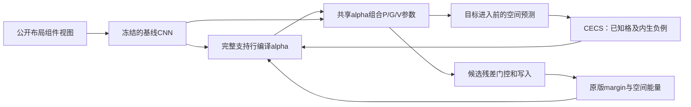

> Rejected prototype. This document preserves the original hypothesis. Routing became input-independent. Use ../design.md for the current method.

# 组件条件预测能量：两个连接在一起的贡献

## 状态与事实边界

这是当前70.38%组件视图基线之上的新方法研究分支。基线在完整20轮
训练中按验证集选择第17轮，测试70.378571%，第20轮测试67.657143%。
新方法的性能必须用自己的检查点验证，不能继承基线数字。

PaV在现有AVR稿件中指Predict-and-Verify。下面把可执行参数程序放进这个
循环。参数程序是本方案的实现对象，不是PaV缩写的另一个定义。

两个贡献的共同对象是**由支持行确定、对候选固定的组件条件预测能量**。
组件视图分解来自公开布局几何，沿用当前基线，不能重新包装为学到的对象发现。

## 为什么需要这两个改变

原版先全局池化预测和观察再算误差，不同空间分布可能得到接近的池化特征。
当前基线的四格、九格、内四外单测试准确率仍为45.60%、33.40%、38.45%。
这些结果支持研究空间信息的必要性，却不证明池化是唯一失败原因。

另一方面，原网络在所有题上执行同一组预测参数。它通过输入隐式适应规则，
没有一个能被固定、移植或干预的题目条件参数对象。

SSL贡献规定这个对象应该学会执行什么任务。PaV贡献规定它如何进入实际
预测和验证计算。两者通过同一个第一阶段预测及共享规则组合系数联合训练。

## 统一表述

每题保留两个组件视图v。支持行s有三个完整格，查询前缀q有两个格，y是
待验证的末格。基线CNN产生32×25空间特征，编译器由支持行产生

```math
\alpha_v(s)=\operatorname{softmax}(c_\theta[
 f_1, f_2-f_1, f_3-f_2]),\qquad \alpha_v\in\Delta^{K-1}.
```

固定alpha后执行三个预测—验证阶段，得到候选能量E_v(s,q,y)。测试仍使用
第一、二行作为两条支持，并对两个组件视图平均。

```math
E(y\mid C)=\frac12\sum_{v=1}^{2}
 [E_v(r_1,q,y)+E_v(r_2,q,y)],\qquad
\widehat y=\arg\min_y E(y\mid C).
```

在八个给定候选上，p(y|C)正比于exp(-E(y|C)/tau)是一种合法的条件能量
表述。这只是模型定义，不能据此声称真实规则已识别、模型已校准或各组件
统计独立。后续阶段利用候选残差，是判别式能量。只有候选写入之前的第一
阶段预测用于下面的生成式补全监督。

## 贡献一：组件内的可执行补全自监督

英文工作名称：**Componentwise Executable Completion Supervision (CECS)**。

保持原版单向已知格任务：[第一行三格，第二行前两格]→第二行末格。
在第一阶段、任何目标残差写入之前，计算空间预测p_0。以已知第六格的
非负CNN特征为目标t，对每个空间位置沿通道归一化。

```math
L_{\rm dense}=\frac{1}{25}\sum_\ell
 \|\bar p_{0,\ell}-\operatorname{sg}(\bar t_\ell)\|_2^2.
```

负例只来自同批训练题的已知第六格，并要求公开布局类型和组件视图索引
相同。与正例像素完全一致的目标不作为负例。以空间平均内积为相似度，
在这个内生目标集合上计算条件InfoNCE。

```math
L_{\rm CECS}=L_{\rm dense}-\log
\frac{\exp(\langle\bar p_0,\bar t\rangle/\tau)}
 {\sum_{u\in\mathcal T(C)}\exp(\langle\bar p_0,\bar t_u\rangle/\tau)}.
```

这里的内积包含空间平均，tau=0.15。此任务不读取八个答案候选、答案
索引或XML规则标签。冻结的基线CNN提供稳定目标，stop-gradient阻止目标
沿这条损失追随预测。不加入坍塌正则。整个训练仍保留原版候选margin任务，
因此**整个模型训练不是candidate-free**。

```math
L= L_{\rm original}/B+0.002\,w_e L_{\rm CECS},\quad
w_e=\min(1,e/2).
```

这个贡献的可检验内容是：目标写入之前的空间补全能力，及其对候选排序的
作用。损失下降本身不能证明规则发现，也不能证明替代原版SSL有效。

## 贡献二：支持行编译的PaV参数程序

英文工作名称：**Support-Compiled Predict-and-Verify (SC-PaV)**。

每个规则基底k是一套完整的预测P、误差门控G和写入V参数。三个阶段
使用同一alpha组合所有角色，避免每层独立路由破坏程序定义。最后一个
阶段只有P，没有后续写入，因此不注册无用的G/V参数。

```math
\Delta W_{l,R}(s)=\sum_{k=1}^{6}\alpha_k(s)
 B_{l,R,k}A_{l,R,k},\qquad R\in\{P,G,V\}.
```

每个BA为rank-4算子。P读取五格特征在每个位置上的160维向量，G/V读取
32维误差。它们直接执行矩阵乘法，参数内容不只是被读成一个attention value。

```math
p_l=P_l^{\rm base}(h_{1:5})+
 \kappa\tanh(\Delta W_{l,P}(s)h_{1:5}),\quad
e_l=\operatorname{ReLU}(h_6)-p_l,
```

```math
\widetilde e_l=e_l\odot[1+\kappa\tanh(\Delta W_{l,G}(s)e_l)],\quad
\Delta h_6=\kappa\tanh(\Delta W_{l,V}(s)\widetilde e_l).
```

kappa=0.25，门控范围为[0.75,1.25]。原版conv/skip更新接收修正后的
残差，然后第六格再接收参数写入。B初始化为零，A随机初始化，便于从
原版计算出发。最终是否生效必须用非零梯度、参数变化和移除/交换干预验证。
初始化等价或原版旁路仍然很强，都不能充当贡献有效性的证据。

监督的两个预测块都使用

```math
E_l=d_{\rm pooled,l}+0.05\,d_{\rm dense,l}.
```

测试用最后一个块，仍沿用两支持行和两视图汇总。dense距离是在25个位置
计算通道归一化特征距离的平方，再平均并开平方。

## 两个贡献如何连接



CECS训练可执行预测，SC-PaV让训练出的题目条件程序进入预测和验证。
二者共享预测算子和alpha，却分别拥有监督构造与执行机制。

## 2026文献及借鉴边界

以下原始arXiv元数据及HTML原文已读取。首发日期与修订日期分开记录。
文献均为预印本，未把它们写成已确认的顶会录用。

| 文献 | 首发 | 可借鉴的操作 | 本方案的边界 |
| --- | --- | --- | --- |
| [Object-centric LeJEPA](https://arxiv.org/abs/2607.02404), Jakob Geusen, Ender Konukoglu | 2026-07-02 | 使用给定mask打破分区与表征的循环依赖，在组件层建立SSL目标 | 该文使用SAM proposals及分布正则。本方案用已有公开布局分图，不声称无先验对象发现，不照搬其正则 |
| [SHINE: A Scalable In-Context Hypernetwork for Mapping Context to LoRA in a Single Pass](https://arxiv.org/abs/2602.06358), Yewei Liu et al. | 2026-02-06，读取v3修订2026-07-04 | 从上下文直接生成可执行低秩参数，冻结基模型以减少适配漂移 | 该文研究LLM上下文适配。本方案的规则原子共享三个PaV角色，且候选不能修改支持程序，不能把LLM结果当AVR证据 |
| [When Does LeJEPA Learn a World Model?](https://arxiv.org/abs/2605.26379), David Klindt, Yann LeCun, Randall Balestriero | 2026-05-25 | 理论要求把变量可识别性及分布假设讲清楚 | 其线性可识别结论依赖高斯潜变量与平稳加性噪声转移，RAVEN未满足这些条件，不能借用其定理证明本方法发现规则 |

检索路径为公开arXiv API与OpenAlex。搜索范围覆盖2026自监督预测、组件
学习和上下文参数生成。这是方法设计所需的定向检索，不是穷尽文献综述。

## 实验合同

- 分支保持发布基线代码及结果不变。新代码位于program_ssl。
- 从验证选中的第17轮基线权重出发，新增8轮完整RAVEN训练。
- 路径上为17+8轮。基线曾完整训练20轮才选到第17轮，资源预算为20+8轮，
  不能描述成8轮从头训练或匹配原版20轮。
- 比较program、control、program-no-ssl三个同预算续训。
- 所有组冻结CNN和BatchNorm，原版推理参数lr=3e-5，新参数lr=3e-4。
- batch=128个原始题、两视图、329步/轮，seed=12345，FP16。
- 验证集选择续训best，初始状态单独记录，不允许未训练状态冒充新方法。
- 训练入口不打开测试集。完成后先分析验证与功能干预，再锁定模型做完整测试。
- 最终报告best和末轮，七个构型、权重/代码哈希、额外训练预算。
- 目标为新方法自己的测试准确率至少70%，同时证明程序分支实际参与计算。

### 功能检查

预检已验证零程序分数与基线完全一致。候选置换前后都等变，新SSL和alpha
不受候选像素影响。第一步SSL预测不受其目标像素影响。两步更新后所有
注册算子及编译器均有有限梯度，移除程序会改变分数。
这些是计算正确性证据，性能和语义规则证据仍待完整实验。

所需后续证据：同预算no-SSL训练，验证集上的程序移除/均匀化/交换，
空间补全误差，以及最终锁定模型的完整测试。没有跨题同规则移植证据前，
只能称可执行题目条件程序，不能称可解释语义规则。
