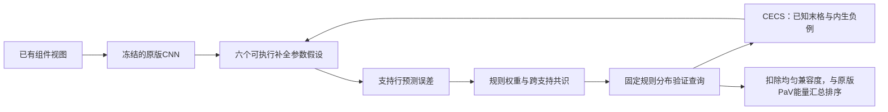

# 组件条件的规则后验预测能量

## 两个贡献及共同架构

共同研究对象是**由完整支持行确定、跨候选保持固定的组件条件规则分布**。
SSL负责学习这个分布怎样执行已知格补全。PaV负责用支持证据更新它，再
对候选执行同一分布下的验证。组件视图来自已发布的70.38%基线，不能将
已有的几何分图重新算作新的对象发现贡献。

### 贡献一：可执行组件补全自监督

工作名称为Componentwise Executable Completion Supervision，CECS。

单向任务保持[第一行三格，第二行前两格]→第二行末格。新训练阶段冻结
原版CNN及三个PaV块，仅训练规则参数和先验网络。数据入口只向新任务
提供六格，答案候选、正确答案索引、XML和第三行前两格都不参与目标或
分图回退判断。基础检查点此前的20轮训练仍使用过原版候选负例，所以
不能把整个训练历史称为candidate-free。

支持行的三个特征只能通过规则分布进入查询补全。查询预测函数本身仅
接收第二行前两格。这条结构性瓶颈排除了“输入直接绕过规则程序”的
路径。监督目标是已知第六格的冻结CNN特征，保留32通道、25个空间位置。

负例来自同批其他训练题的已知第六格，限定相同公开布局类型和组件索引。
与正例逐像素相同的图像被屏蔽。以条件补全能量构造InfoNCE，同时压低
正例补全能量。不使用坍塌正则，也不使用此前的双向交换行任务。

```math
L_{\rm CECS}=E(t\mid s,q)
 -\log\frac{\exp[-E(t\mid s,q)/\tau]}
 {\sum_{u\in\mathcal T(s,q)}\exp[-E(u\mid s,q)/\tau]}.
```

这里s是完整支持行，q是查询行前两格，t是已知末格，tau=0.15。
空间预测目标针对原版池化误差可能丢失位置的信息。它没有重新学习CNN
的对象感知，不能把规则适配的收益说成感知模型已经解决。

### 贡献二：由支持证据校准的预测—验证

工作名称为Support Evidence Ratio Predict-and-Verify，SER-PaV。

六个参数假设是实际执行的补全算子。每个算子读取两个查询格，输出一个
32×25预测。算子由可训练仿射系数和rank-4参数修正组成。

```math
P_k(q_1,q_2)=a_k\operatorname{ReLU}(q_1)
 +b_k\operatorname{ReLU}(q_2)
 +0.5\tanh[B_kA_k(\operatorname{ReLU}(q_1)\oplus\operatorname{ReLU}(q_2))].
```

六组仿射初值分别为(0,1)、(1,0)、(-1,2)、(0.5,0.5)、(1,1)、(2,-1)。
它们是特征变换的初始化先验，不是RAVEN规则标签。归一化验证器可能使
部分初始参数假设在功能上重合，学习和干预需要检查实际行为，不能从
参数名称推出语义规则独立性。B初始为零，A随机初始化。原版预测路径
保持冻结。训练及逐轮选模使用新规则能量权重0.1。选出检查点后，在完整
验证集上从预先写入评估器的0.05、0.1、0.2中选择正权重，并将它固定用于
最佳及末轮测试。零权重仅作为移除干预，不能入选并冒充新增机制生效。
验证诊断后，新增支持证据比作为第二个推断选项。每组在两个能量形式和
三个权重的六项验证网格中选择，不能把这说成最初就预注册的方案。

每个完整支持行先执行P_k(s_1,s_2)，再与已知s_3比较。空间和池化距离
各占一半，均计算通道归一化特征的平方距离。测得的支持误差更新规则权重。

```math
\alpha_k(s)=\operatorname{softmax}_k[
 0.5\tanh(c_\theta(s)_k)-E_k(s_3\mid s_1,s_2)/\tau_s].
```

先验输出有界，使它不能淹没实际支持误差。这是对计算角色的限制，不是
分布反坍塌损失。查询候选不进入支持误差或编译器。

验证时保留各假设，先计算边缘化能量，避免先平均不同规则的预测。

```math
E(y\mid s,q)=-\tau_v\log\sum_k\alpha_k(s)
 \exp[-E_k(y\mid q)/\tau_v],\qquad \tau_s=\tau_v=0.15.
```

训练只有第一行支持第二行查询。测试的两条完整支持行通过归一化几何
平均合成规则分布，再固定这份分布验证第三行候选。这是广义专家乘积，
不是在未证明的独立性假设下宣称精确贝叶斯后验。

```math
\alpha_k(C)\propto\sqrt{\alpha_k(r_1)\alpha_k(r_2)},\qquad
\Delta E_v(y)=E_v(y\mid C,q)-E_v(y\mid q,\alpha=\mathrm{Uniform}),\qquad
E_{\rm total}(y)=E_{\rm baseline}(y)
 +\frac{\beta}{2}\sum_{v=1}^{2}\Delta E_v(y).
```

该差值等于条件混合兼容度相对均匀混合兼容度的负对数比乘以温度。
若定义在同一有限候选集合上的归一化分布，它与负对数概率比只差一个
所有候选共享的常数。均匀混合项用于扣除不需要支持行就能得到的外观
兼容度。支持证据完全均匀时，新增项严格为零。真实推断是否受它影响，
仍需检查改变的答案数及支持交换干预。

原版三个预测块及两支持行的误差求和不变。最初的直接后验能量叠加也
保留为同一检查点上的验证对照，检查点仍按训练时的原形式选定，不能
用新评分重选全部八轮。验证选择推断形式之后固定用于最佳及末轮测试。
新机制增加支持证据校准与证据比验证，不保留被首轮试验证实冗余的
P/G/V增量模块。

## 同一理论架构里的分工

条件能量定义在有限完成集合上，对应p(y|s,q)正比于exp(-E/tau)。CECS
用已知格与内生目标学习它，SER-PaV用支持预测误差构造规则分布，再将
其条件兼容度与同一组算子的均匀兼容度比较。候选只参与验证，不能修改
它所接受的支持权重。



这提供统一的能量建模表述和可执行程序接口。尚无高斯潜变量假设、可识别
定理或跨题语义移植证据，因此不能称为已证明的语义规则发现理论。

## 2026文献

原始arXiv元数据、HTML方法章节及相关限制已经核对。

| 论文 | 首发日期 | 借鉴及界限 |
| --- | --- | --- |
| [Object-centric LeJEPA](https://arxiv.org/abs/2607.02404), Jakob Geusen, Ender Konukoglu | 2026-07-02 | 给定mask打破分区和表征的循环依赖，组件级目标及实例区分。该文用SAM 2 mask与SIGReg，本方案用已有布局分图，不移植其反坍塌正则或对象发现表述 |
| [SHINE: A Scalable In-Context Hypernetwork for Mapping Context to LoRA in a Single Pass](https://arxiv.org/abs/2602.06358), Yewei Liu et al. | 2026-02-06，读取v3修订2026-07-04 | 借鉴上下文指导可执行低秩适配、冻结基础模型的思路。该文直接生成LoRA，本方案从支持行推断已有低秩算子假设的分布，不直接生成LoRA。LLM结果不能当作AVR证据 |
| [When Does LeJEPA Learn a World Model?](https://arxiv.org/abs/2605.26379), David Klindt, Yann LeCun, Randall Balestriero | 2026-05-25 | 可识别性要写出分布与转移假设。其高斯、平稳加性噪声条件未在RAVEN验证，不能借其定理证明这里的规则可识别性 |

均按预印本引用，没有确认顶会录用。检索通过OpenAlex与arXiv公开接口，
这是定向方法检索，不是穷尽综述。

## 试验合同和证据

发布基线：20轮完整训练，验证选择第17轮，测试70.378571%。最后一轮
测试67.657143%。新方法从第17轮初始化，新增8轮完整训练，路径为17+8，
已有基线的训练选择成本为20轮，因此资源预算为20+8轮。

四组都使用同一初始检查点、42000题/轮、329步、batch128、seed12345。
原版续训冻结CNN和BatchNorm，推理参数lr=3e-5。

| 组 | 训练信号 | 可训练部分 | 目的 |
| --- | --- | --- | --- |
| program | 新CECS，只有六个已知格 | 补全参数和先验，lr=3e-4 | 完整方案 |
| control | 原版候选margin | 原版三个推理块 | 同预算原版续训 |
| program-no-ssl | 原版候选margin | 补全参数和先验，基线全冻结 | 检查新SSL目标作用 |
| program-static | CECS，固定均匀规则分布 | 同样的补全参数 | 检查题目条件支持证据作用 |

控制组与完整组可训练参数、训练图像数和计算量不同，应报告壁钟时间，
不能声称相同计算量。三组新程序比较保留相同冻结基线。所有训练入口
不打开测试集，初始验证单列且不能选为新方法检查点。完整验证选择best，
完成对照和机制审计后锁定best/final的SHA256，再做完整测试。

修正版预检通过：移除新程序后分数与基线完全相同，候选置换等变，SSL
拒绝16格输入，改变原题最后10格不影响训练预处理，目标不影响预测它的
程序或查询预测，FP16梯度有限，支持程序在训练前已随输入变化。

第一个P/G/V低秩增量原型被主动否决。第5轮的112题诊断中alpha方差为零，
固定均匀规则未改变答案，说明原任务能绕过该编译器。旧代码快照及运行
记录保留在远端component-program-20261003-source/run，退出码130为人工
停止。没有把旧原型的71.54%验证结果当修正版结果。

第二版同样被否决。其分图的全局回退检查了第六格，改变待预测目标可能
改变前五格的输入。在真实嵌套布局样本上，单独将第六格改白会改变2671个
前五格视图像素。第二版完整方案虽完成8轮，其69.835714%最佳验证结果
不作为当前方案证据，未打开该版测试集。记录保留在archive-v2。

第三版只让前五个可观察输入决定全局回退，目标及候选各自独立回退。
同一真实样本的前五格变化为0像素。新增SSL训练和补全验证均采用此边界。
候选排序仍使用已发布基线的八个已知上下文分图，以保持与基线的推理
兼容性。这两种预处理用途要分开报告。

当前试验远端：support-program-v3-20261003，tmux：support-program-v3。
四组训练都保留原生图像验证。独立机制审计及锁定后的测试可用冻结CNN
特征缓存加速。缓存指纹包含CNN权重、数据路径/大小/时间戳、相关代码、
库版本、GPU和数值后端。完整14000题的基础版和新增版验证计数逐构型
与原生评估完全一致，验证加载器随机状态也一致。缓存没有用于训练。

四组八轮已完成，验证审计通过，测试锁定后完成全部14000题评估。
完整方案选择证据比、权重0.05。验证选中检查点测试70.257143%，末轮
70.264286%，基础版70.378571%。已知格检索相对原目标适配提高2.14个
百分点，同一模型支持均匀化降低1.03个百分点。候选准确率没有明确收益，
原版推理续训对照更高，不能把这两个补全证据写成候选推理显著改进。

详见[贡献及边界](contributions.md)、[完整结果](results.md)和[计算性质](theory.md)。
移除、均匀化、同布局同组件的程序交换仅提供即时依赖证据。没有跨题
同规则移植证据前，只称可执行参数假设，不称可解释语义规则。
