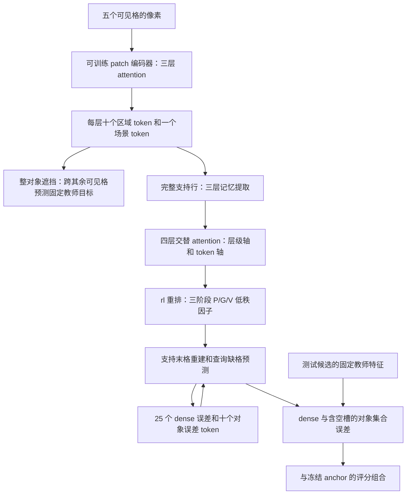

# V3：支持记忆到动态参数的重排修正

## 当前结构

两个贡献分别针对表示学习和支持条件推理。对象遮挡辅助项使用前五格，
单向已知第六格排序使用六个已知格；适配时不读八个答案候选、XML 或
答案索引。推断时两个完整支持行分别生成参数、预测第九格。对象轮廓
仍是图像先验，教师目标不是已经验证的语义属性。

本轮没有增加双向任务、坍塌约束或 Mamba。当前结构使用 attention。
训练目标、学习率、八轮预算和三个适配种子沿用已登记协议。

## 为什么更正参数生成

V1 完整验证退步：同平台 anchor 71.5143%，best 71.2286%，final 69.8786%。
21 道验证题的诊断显示，每个声明 rank8 的线性更新有效秩接近 1。这是
局部更新的测量，不能归因全部退步，也不是整条非线性网络的秩。

重新核对 [SHINE](https://arxiv.org/abs/2602.06358) Appendix A.2：原文明确
说明 `rl/lr` 更易优化，并且所有实验使用 `rl`。旧版参数排列相当于 `ll`。
V3 将 A 的扁平块按 width×rank 排列，再转为执行器需要的 rank×width；
B 保持 rank×width。每个向量的 FP32 归一化是本项目的数值适配，不能称为
原文的缩放方式。另同步两个明确的源码设计：

- 记忆提取之后加入零初始化的可学习层级和 token 身份。
- 四层轴向 Transformer 使用 post-norm、GELU、dropout0。

官方源码固定为 `MuLabPKU/SHINE@fd606798c5d0e0f7d2c82df1204a83f8a1104036`。
路径、URL 和 hash 见 [shine_source_manifest.json](shine_source_manifest.json)。
发布配置的 `couple_num_layers` 为 0；没有把可选的 A/B 专用 couple 层描述
成原文运行中的模块。SHINE 是上下文到 LoRA 的语言模型方法，这里是
支持行到小型视觉推理器参数的适配，不继承它的性能结论。

## 已验证的机制和局限

独立按 Appendix A.2 Eq.15 的元素索引验证 `pack_factors`，避免用生产
reshape 本身构造期望结果。合成的完全相同记忆 token 中：旧 `ll` 的
rank 坐标投影差异和 B 梯度差异为 0；`rl` 分别为 3.35205 和 0.00131713。
这说明新排列可解除一种梯度对称性。此时 B 仍相同、线性更新仍可为
rank1，**不证明实际训练会恢复 rank8，也不证明准确率提升**。

三份独立源码（主模型、移除对象遮挡项、静态支持参数）均已通过 CPU
合成检查：目标隔离、有限梯度、候选/对象重排、冻结 anchor、零门控评分
相等、激活重计算和上述参数排列检查。检查文件的 fixture 明确为合成数据。
可训练参数为 2,275,350，冻结参数为 958,345。

真实 Metal batch128 检查已完成：128 道官方训练题、七个配置，三个更新
前后向均有限，输入不变，CPU/Metal RNG 恢复逐位相同。三步耗时约
5.28/2.99/2.90 秒，driver 峰值约 7.72GB。这些是容量/数值检查，重复同一
批训练题，不是完整 RAVEN 准确率；详见
[v3-real-batch128-mps-preflight.json](v3-real-batch128-mps-preflight.json)。

## 固定新实验

当前运行目录：`runs/structured-shine-rl-priority-metal-20261003-213645`。
原封存目录 `runs/structured-shine-rl-metal-20261003-212041` 保留；其源码和
三份 CPU 检查逐字节复制到新目录，源文件 hash 和登记预算全部相同。
主模型种子 12345/12346/12347；同容量对照为 `no_object_masking` 和
`static_parameters`，各八轮。完整 42k 训练、14k 验证、batch128、Metal。
完整验证选择 best；final 单独报告。测试不决定架构或超参数。

源码在训练前封存。初始调度让原版16轮对照及其完整评估先结束，再运行
V3；暂停旧V1 coordinator时没有中断native子进程。用户随后指定仅维护
V3，旧V1待运行队列已退出，当前coordinator不会恢复它。
原队列在正式训练前明确重排，exit1、旧调度源码和重排记录全部保留；
该 exit1 是主动调度中断，不是模型数值失败。详见
[v3_priority_scheduling.json](v3_priority_scheduling.json)。原版对照和其完整
评估已完成，V3已通过真实batch128检查并完成主种子12345的八轮训练。
主种子的完整初始验证复现同平台anchor；第1轮验证10004/14000=71.4571%，
是八轮中的第一个最大值。早期记录见
[v3_first_epoch_validation.json](v3_first_epoch_validation.json)。

用户在部分验证结果可见、首次V3测试前将目标改为70%。该变更单独记录，
保留源码和验证选模；不能称训练前预注册门槛。完整验证和测试复核后，
best测试71.2786%，final测试69.6429%。两个贡献的独立收益仍待对照。
移除对象遮挡和静态支持参数对照均已完成，另两个主种子仍待完成。
V2队列曾因父套件失败终止，只有CPU检查，没有正式RAVEN训练；其所有
封存记录保留。

## 原版对照的数值修复

原对照在第 8 轮失败；原日志未记录失败 batch 索引。恢复第 7 轮 checkpoint、
数据加载器和 dropout RNG 后，在第七个 batch 复现；第二个 PRB 出现一个
精确零距离。AMP scale 从
131072 降到 65536/32768/1 均不解决问题。

`sqrt(sum(error**2))` 的组合反向在零处产生非有限梯度。新私有 autograd
操作保留完全相同的前向，零处取合法的零次梯度；没有向评分加 epsilon。
真实失败 batch 在原 scale 下 loss 逐位相同、反向有限。CPU 非零梯度
与旧公式一致并通过 gradcheck。原 checkpoint 的模型/optimizer/scaler/RNG
字节不修改，复制到新目录，改动源文件只为 `sspredrnet/model.py`。

原失败目录、exit1 和日志保留。恢复目录为
`runs/structured-metal-recovered-20261003-211738`；从完整第 7 轮继续完成
既定 16 轮。V3与其两个贡献对照、另两个种子继续运行；用户指定仅保留V3后，旧V1待运行队列已退出。源码迁移写入
`numerical_repair.json`，结果收集器验证迁移记录。诊断见
[native_stable_l2_replay.json](native_stable_l2_replay.json) 和
[packing_numerics_contracts.json](packing_numerics_contracts.json)。

修复后的 native 对照已完成固定 16 轮，完整源码/config/checkpoint/history
以及 best/final 的独立验证与测试通过收集器核验。验证最大值在第16轮，
所以 best 和 final 是同一个 checkpoint：验证10025/14000=71.6071%，
测试10006/14000=71.4714%。这不是 V3 成绩，也不能将其与历史 CUDA 的
数字当作同平台配对比较。完整七配置和迁移记录见
[native_completed_audit.json](native_completed_audit.json)。原版适配仍用
未标注候选作为负例，V3 适配不使用；官方 57.1% 的测试选模协议也不同。

## 当前主线

当前仅维护V3，模块和协议见[design.md](design.md)。主种子验证选中的
checkpoint测试71.2786%，final69.6429%；对照已完成，另两种子仍待完成。
旧版本文档和诊断已归档，当前模型不会加载旧版实现或提供版本切换。
