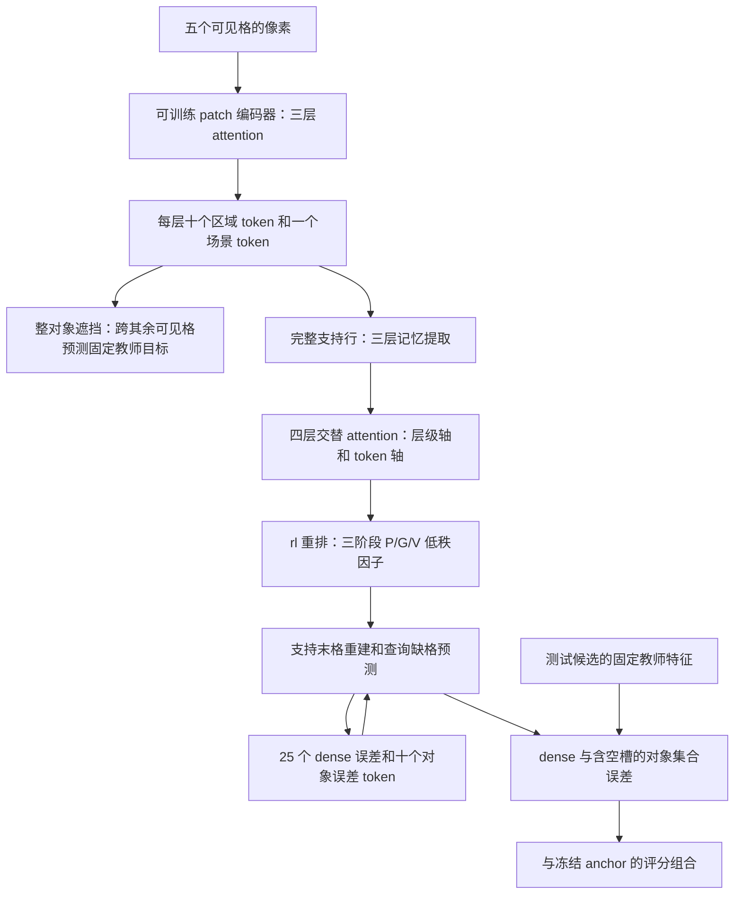

# V3：支持记忆到动态参数的重排修正

## 当前结构

两个贡献分别针对表示学习和支持条件推理。对象遮挡辅助项使用前五格，
单向已知第六格排序使用六个已知格；适配时不读八个答案候选、XML 或
答案索引。推断时两个完整支持行分别生成参数、预测第九格。对象轮廓
仍是图像先验，教师目标不是已经验证的语义属性。

本轮没有增加双向任务、坍塌约束或 Mamba。当前结构使用 attention。
训练目标、学习率、八轮预算和三个适配种子沿用已登记协议。

## 为什么更正参数生成

V1 完整验证退步：同平台 anchor 71.5143%，best 71.2286%，final 69.8786%。
21 道验证题的诊断显示，每个声明 rank8 的线性更新有效秩接近 1。这是
局部更新的测量，不能归因全部退步，也不是整条非线性网络的秩。

重新核对 [SHINE](https://arxiv.org/abs/2602.06358) Appendix A.2：原文明确
说明 `rl/lr` 更易优化，并且所有实验使用 `rl`。旧版参数排列相当于 `ll`。
V3 将 A 的扁平块按 width×rank 排列，再转为执行器需要的 rank×width；
B 保持 rank×width。每个向量的 FP32 归一化是本项目的数值适配，不能称为
原文的缩放方式。另同步两个明确的源码设计：

- 记忆提取之后加入零初始化的可学习层级和 token 身份。
- 四层轴向 Transformer 使用 post-norm、GELU、dropout0。

官方源码固定为 `MuLabPKU/SHINE@fd606798c5d0e0f7d2c82df1204a83f8a1104036`。
路径、URL 和 hash 见 [shine_source_manifest.json](shine_source_manifest.json)。
发布配置的 `couple_num_layers` 为 0；没有把可选的 A/B 专用 couple 层描述
成原文运行中的模块。SHINE 是上下文到 LoRA 的语言模型方法，这里是
支持行到小型视觉推理器参数的适配，不继承它的性能结论。

## 已验证的机制和局限

独立按 Appendix A.2 Eq.15 的元素索引验证 `pack_factors`，避免用生产
reshape 本身构造期望结果。合成的完全相同记忆 token 中：旧 `ll` 的
rank 坐标投影差异和 B 梯度差异为 0；`rl` 分别为 3.35205 和 0.00131713。
这说明新排列可解除一种梯度对称性。此时 B 仍相同、线性更新仍可为
rank1，**不证明实际训练会恢复 rank8，也不证明准确率提升**。

三份独立源码（主模型、移除对象遮挡项、静态支持参数）均已通过 CPU
合成检查：目标隔离、有限梯度、候选/对象重排、冻结 anchor、零门控评分
相等、激活重计算和上述参数排列检查。检查文件的 fixture 明确为合成数据。
可训练参数为 2,275,350，冻结参数为 958,345。

## 固定新实验

运行目录：`runs/structured-shine-rl-metal-20261003-212041`。
主模型种子 12345/12346/12347；同容量对照为 `no_object_masking` 和
`static_parameters`，各八轮。完整 42k 训练、14k 验证、batch128、Metal。
完整验证选择 best；final 单独报告。主模型未通过不退步/支持生效门槛时
推迟测试；已登记对照可报告下降。不能用测试集决定架构或超参数。

源码在训练前封存。队列当前等待原固定套件的恢复和完成；**V3 没有
完整训练准确率，也没有建立两个贡献的独立收益**。V2 队列因父套件失败
终止，只有 CPU 检查，没有正式 RAVEN 训练；其所有封存记录保留。

## 原版对照的数值修复

原对照在第 8 轮第七个 batch 失败。恢复第 7 轮 checkpoint、数据加载器
和 dropout RNG 后复现；第二个 PRB 出现一个精确零距离。AMP scale 从
131072 降到 65536/32768/1 均不解决问题。

`sqrt(sum(error**2))` 的组合反向在零处产生非有限梯度。新私有 autograd
操作保留完全相同的前向，零处取合法的零次梯度；没有向评分加 epsilon。
真实失败 batch 在原 scale 下 loss 逐位相同、反向有限。CPU 非零梯度
与旧公式一致并通过 gradcheck。原 checkpoint 的模型/optimizer/scaler/RNG
字节不修改，复制到新目录，改动源文件只为 `sspredrnet/model.py`。

原失败目录、exit1 和日志保留。恢复目录为
`runs/structured-metal-recovered-20261003-211738`；从完整第 7 轮继续完成
既定 16 轮，然后完成原套件待运行的对照和种子。源码迁移写入
`numerical_repair.json`，结果收集器验证迁移记录。诊断见
[native_stable_l2_replay.json](native_stable_l2_replay.json) 和
[packing_numerics_contracts.json](packing_numerics_contracts.json)。
