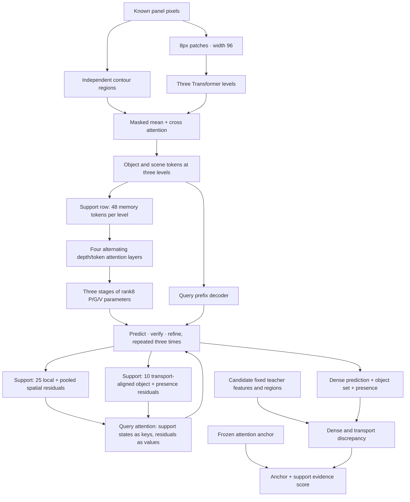

# Object-masked SSL + support-compiled SER-PaV

Experimental redesign, **without a complete RAVEN accuracy result yet**.
The preceding small attention branch averaged 71.22% test accuracy. This
package's v2 revision has 2,270,454 trainable parameters and freezes the preceding primary
validation-selected model's 958,345 parameters. Capacity alone is not evidence
of better reasoning. See the [design and fixed evaluation protocol](../research/structured-ssl-2026/design.md).

## Architecture



The SSL contribution trains raw pixel/object representations with complete
region masking in the first five known panels, plus the existing one-direction
known-sixth completion ranking. The SER-PaV contribution compiles complete
support rows into stage/role-specific low-rank weights and uses support
reconstruction errors to refine the next query prediction. For v2, each region's
bbox is independently placed on a white panel before the immutable CNN encodes
and pools it. Pixels outside that bbox cannot affect its target. Location/scale
remain in appearance, and overlapping objects inside a bbox remain a limitation.
Dense targets retain the original whole-panel teacher space. Support verification
keeps all 25 positions, the pooled dense residual, and transport-aligned object
appearance/geometry/presence; attention transports these errors into query states.
Candidate order cannot affect compilation.

Regions are exterior contour proposals, **not discovered semantic objects**.
Given image-only proposals and layout priors, this is a self-supervised
adaptation. Historical anchor pretraining used candidate negatives. No answer
candidates/answer indices/XML enter the new adaptation. The new predictor sees
only five panels; its auxiliary masking task also excludes the sixth panel.
There is no bidirectional row task or collapse regularizer.

Concrete 2026 adaptations:

- Object-centric LeJEPA §4.1: masked mean, cross-attention and residual pooling.
  SAM and SIGReg are not adopted.
- Causal-JEPA §4: whole-entity masking and fixed latent targets, adapted to
  static known RAVEN panels. This is not a causal identification claim.
- SHINE §3.3–3.4: multi-depth memory, alternating attention and actual dynamic
  low-rank parameter generation. This does not reproduce its LLM system.

## Commands

From repository root, use the already measured primary seed12345 anchor:

```bash
python -m structured_ssl.check_contracts \
  --anchor research/ssl-attention-2026/results/seed12345/best.pt \
  --device cpu --output structured-preflight.json

python -m structured_ssl.train \
  --dataset-root /path/to/RAVEN --run-dir runs/structured-raven8-seed12345 \
  --anchor research/ssl-attention-2026/results/seed12345/best.pt \
  --epochs 8 --seed 12345

python -m structured_ssl.evaluate \
  --dataset-root /path/to/RAVEN --run-dir runs/structured-raven8-seed12345 --split val

python -m structured_ssl.evaluate \
  --dataset-root /path/to/RAVEN --run-dir runs/structured-raven8-seed12345 --split test
```

Full training supports CUDA or explicit `--device mps` and requires exactly
42,000/14,000 train/validation puzzles. Evaluation uses the recorded device.
Metal runs retain batch128, FP16 adaptation, FP32 teacher/evaluation, and capture
Metal RNG for resume. Perception activation checkpointing preserves the
architecture and loss; CPU outputs and gradients match without recomputation.
Metal additionally requires `--platform-validation` pointing to the recorded
complete validation of its immutable anchor. Both CPU and Metal produced
10012/14000 for the same preceding attention checkpoint, versus its historical
CUDA record of 10014. That two-puzzle discrepancy remains disclosed; its cause
has not been fully identified. This is baseline calibration, not a new model gain.
Test opens only after the selected best passes the complete validation audit.
Best/final source and checkpoint hashes are sealed. Resume with unchanged
arguments and `--resume`. Evaluation refuses to overwrite an existing result.
No gain is accepted from a zero gate or an unchanged answer set. Reports include
all seven layouts, final/best, helped/hurt and an isolated support intervention.

CPU contracts in [cpu_contracts.json](../research/structured-ssl-2026/cpu_contracts.json)
use synthetic shapes, verify real gradients and candidate/object permutations,
and explicitly have `full_raven_evaluation: false`. They do not verify CUDA
memory use, mixed precision or benchmark accuracy.

The official archive hash and all split counts were verified locally. The v1 three
Metal updates on 128 actual training puzzles used about 7.46 GB of driver
allocation, with finite FP16 gradients, unchanged inputs, and successful CPU/
Metal RNG replay. This capacity check is not a complete epoch or accuracy result.
V2 has CPU/Metal synthetic mechanism checks and four actual validation locality
interventions. Its real batch128 preflight and full experiment run separately;
v1 memory/timing figures must not be attributed to v2.

The v1 Metal run is preserved in
`runs/structured-metal-calibrated-20261003-173653`. Its complete eight-epoch
primary best is71.2286% validation (epoch1), final69.8786%, below the same-platform
frozen anchor's71.5143%. The independent best/final validation audit replayed
these counts and deferred test. See the [complete validation and sampled
compiler-rank diagnosis](../research/structured-ssl-2026/v1_primary_diagnosis.md).
V2 corrects two measured information losses; no v2 accuracy gain is established.
See [revision details](../research/structured-ssl-2026/revision-v2.md).

The matched native continuation is available as:

```bash
PYTHONPATH=. python research/structured-ssl-2026/original_continuation.py \
  --dataset-root /path/to/RAVEN --run-dir runs/structured-original16 \
  --baseline program_ssl/results/support-program-v3/control/best.pt \
  --epochs 16 --seed 12345
```

For a local Metal suite use `research/structured-ssl-2026/run_metal_suite.sh`
with separately sealed primary and contribution-control source exports. It runs
the primary, the native continuation, two controls and two further adaptation
seeds sequentially. A failed primary validation gate defers that test without
changing the fixed designs or training budgets.
The suite root includes `reference-anchor-validation.json` and
`reference-native-validation.json`; initial validation must exactly replay the
corresponding measured platform count before any optimizer updates.

The reference test score is 71.2357%; earlier original continuation final
reached 71.41%. Neither number is a new result of this redesign. A matched
original continuation, two isolated contribution controls and multiple
adaptation seeds remain required by the full experiment protocol.
